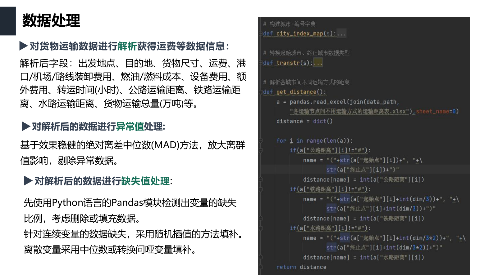
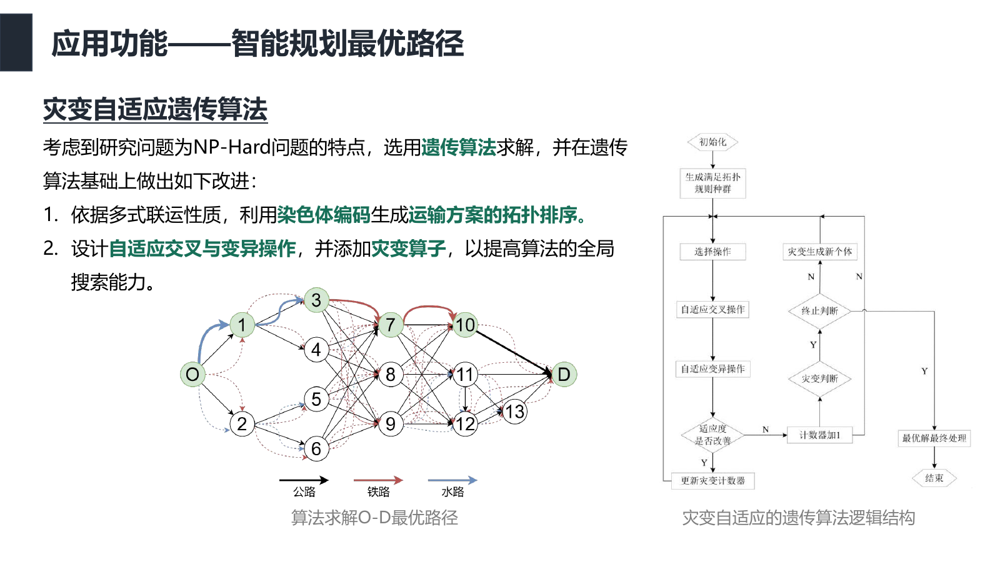
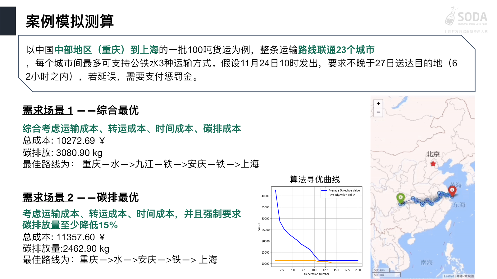

# Carbon-Aware Multimodal Freight Routing

Evidence-preserving recovery and maintained extension of a 2022 Shanghai Open Data Innovative Application Competition project. The original case studies road, rail and inland-water routing from Chongqing to Shanghai through a 23-city corridor; the maintained implementation makes the workflow reproducible, testable and scalable without presenting synthetic orders as historical enterprise data.

**2022 team project | Preliminary round → Semifinal → Final | Third Prize | Reproducible maintained implementation**

## What was achieved in 2022

Jingfan Xin designed and wrote the project-specific routing and quantitative-analysis code and designed the algorithm; one teammate shared the manual data-collection work. Geatpy, NumPy, Pandas and Folium are third-party dependencies and are not claimed as personal implementations.

## Three-stage competition progression

This was not a one-step submission. The entry passed three successive selection stages between September and November 2022:

| Stage | What the team submitted or defended | Outcome |
| --- | --- | --- |
| **1. Preliminary round** | Problem framing, data plan and initial feasibility proposal | Advanced to the semifinal |
| **2. Semifinal** | A 34-page technical report covering data preparation, optimization design, prototype screens and model outputs | Advanced to the final |
| **3. Final** | A 30-slide final presentation and defense with a detailed Chongqing-Shanghai case calculation | **Third Prize** |

The public evidence is deliberately limited to selected technical pages and slides, rather than the complete decks, to avoid publishing team-identifying information or unrelated third-party material. See the [stage evidence and privacy notes](evidence/README.md).

## Original workflow and output evidence

The images below are full-page renders from the archived 2022 semifinal report and final presentation. They have not been cropped, rewritten or recreated.

**Data preparation described in the semifinal report**



**Optimization workflow presented in the semifinal**



**Final-round case output**



These are historical presentation artifacts. Prototype screens are not evidence of a deployed service, and the archived numerical claims are interpreted through the repository's [results audit](docs/results.md). The [evidence gallery](evidence/README.md) includes two additional result/output slides and the original code fragments.

## The engineering problem

The recovered implementation and contemporaneous artifacts support the following description:

- 23 base cities expanded into 69 city-mode nodes for road, rail and water.
- 253 populated city pairs and 754 available mode-distance values: 253 road, 250 rail and 251 water.
- A 69-integer priority chromosome, greedy route decoding and one scalar objective combining transport, transfer, delivery-window and carbon costs.
- A standard Geatpy SEGA baseline and a documented adaptive/catastrophe design: fitness-dependent crossover and mutation plus random population injection after 20 unchanged generations.
- Saved 100-generation runs. Two terminal artifacts end at generation index 99 with 100,000 reported evaluations; the defense document embeds the matching trace plot and reports the 23-node experiment.

The recovered `main.py` currently contains `NIND=100000, MAXGEN=1`. Those are editable values from one saved configuration, not evidence that the 2022 algorithm could not or did not run multiple generations. The byte-exact project snapshot does not itself contain the custom adaptive controller described in the defense material, so identifying that precise historical source revision remains an archival gap.

## Data boundary

The project did not process hundreds of thousands of real shipment transactions. Its historical optimization input is a 23-city case network, parameter tables and three demand scenarios. Shanghai public data supplied useful road and aggregate freight context; the rail/water/transfer-point data needed for the Chongqing-Shanghai case were manually collected by the team.

The maintained implementation therefore labels every data product as one of:

- historical/public or manually collected evidence;
- a derived aggregate that does not redistribute row-level source data;
- a model assumption;
- reproducible synthetic benchmark data.

Objective-function evaluations are computational work, not source-data rows. See [`data/historical_aggregate_profile.json`](data/historical_aggregate_profile.json) and [`docs/data.md`](docs/data.md).

## Repository structure

- [`historical/GA_code`](historical/GA_code): byte-exact 2022 project snapshot; never modernized in place.
- [`compatibility`](compatibility): guarded path adapter for authorized workbook copies.
- [`routing`](routing): tested current model and solvers.
- [`routing/native_ga.py`](routing/native_ga.py): dependency-free, equal-budget GA ablations.
- [`routing/pipeline.py`](routing/pipeline.py): order consolidation, edge-state filtering, routing and SVG output.
- [`routing/synthetic.py`](routing/synthetic.py): explicitly synthetic 23-city and larger benchmark generator.
- [`docs/ORIGINAL_GA_CODE_ANALYSIS_CN.md`](docs/ORIGINAL_GA_CODE_ANALYSIS_CN.md): Chinese evidence analysis.
- [`docs/ORIGINAL_VS_CURRENT_CN.md`](docs/ORIGINAL_VS_CURRENT_CN.md): historical/current comparison.
- [`docs/CURRENT_IMPLEMENTATION_CN.md`](docs/CURRENT_IMPLEMENTATION_CN.md): current end-to-end implementation, benchmark and interview claim boundaries.
- [`docs/GEATPY_RESULTS_ANALYSIS_CN.md`](docs/GEATPY_RESULTS_ANALYSIS_CN.md): real-Geatpy ablation analysis, convergence plots and route visualization.

The earlier document-derived implementation first appeared in commit `329d84ea50ed9b19169d410f596266c333531f12`; the source-recovery baseline was `2f3551f4db70f79ca39471f2226676686c1caad8`.

## Current maintained implementation

The extension keeps the historical single-objective model available while adding:

- historical 500/1,000 km rate bands, progressive carbon pricing, scenarios, capacity and edge availability;
- input validation, cycle-safe decoding and deterministic seeds;
- exact enumeration for small instances and a fast state-Dijkstra comparison baseline;
- four equal-candidate-budget GA variants: fixed baseline, adaptive-only, catastrophe-only and combined;
- greedy order consolidation, simulated road/rail/water closures and end-to-end batch planning;
- self-contained SVG maps generated from the computed solution;
- calibrated synthetic generation for 23-city/754-edge networks and up to user-selected order counts.

The fitness-spread adaptive formula in the current solver is a later engineering choice. It is not presented as the unrecovered 2022 formula.

## Run and verify

Core tests require only Python 3.10+:

```bash
python3 -B -m unittest discover -s tests -v
python3 -B tools/audit_results.py
python3 -B tools/verify_repository.py
```

Run the mandatory real-Geatpy suite in its pinned Linux amd64 container (also supported through Docker Desktop on Apple Silicon):

```bash
sh tools/run_geatpy_tests.sh
```

This installs the official Geatpy 2.7.0 wheel and its `libgomp1` system dependency inside the image, runs all 12 integration tests, and executes the Geatpy CLI fixture. See [`docs/GEATPY_VALIDATION.md`](docs/GEATPY_VALIDATION.md).

Generate the 30-seed real-Geatpy ablation, machine-readable results and SVG figures:

```bash
sh tools/run_geatpy_experiment.sh
```

Run the small exact example or the dependency-free GA:

```bash
python3 -B -m routing \
  examples/synthetic-network.json --solver exact

python3 -B -m routing \
  examples/synthetic-network.json \
  --solver native-ga --population 80 --generations 100 --seed 42
```

Generate transparent synthetic data and execute the full flow:

```bash
python3 -B tools/generate_synthetic_benchmark.py \
  --nodes 23 --orders 1000 \
  --network-output /tmp/network.json --orders-output /tmp/orders.json

python3 -B tools/run_full_pipeline.py \
  /tmp/network.json /tmp/orders.json --solver dijkstra
```

Run four GA ablations across multiple seeds:

```bash
python3 -B tools/run_scalability_benchmark.py \
  --nodes 23 --orders 100000 --population 80 --generations 100 \
  --seeds 0,1,2,3,4,5,6,7,8,9 --output /tmp/benchmark.json
```

These commands do not read or write the original SODA evidence directory.

## Claims and limits

- Historical outputs are simulated case-study results, not measured deployment savings.
- GA outputs are heuristic unless checked against an exact small-instance baseline; they are not global-optimality certificates.
- Synthetic order benchmarks demonstrate pipeline behavior and measured scale only; they are not real enterprise records.
- The proposal's live tracking, blockchain and government-platform concepts were not recovered as deployed services.
- Raw workbooks, personal records, downloaded reference projects and third-party framework source are excluded from this repository.

See [`RIGHTS_AND_ATTRIBUTION.md`](RIGHTS_AND_ATTRIBUTION.md) before reuse.
