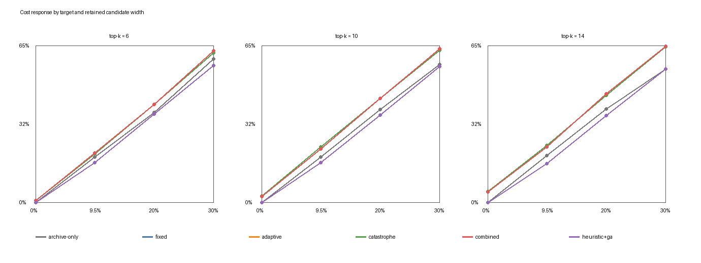
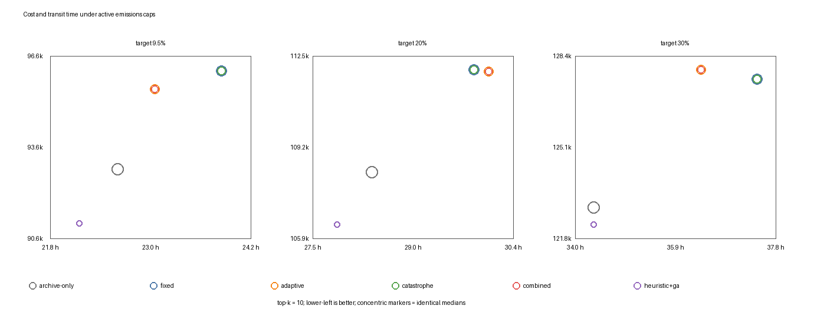
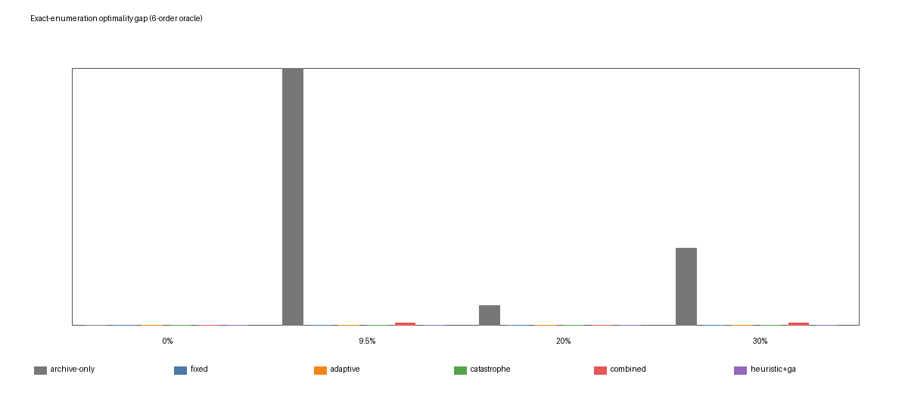

# Algorithm-discrimination benchmark

This is a separate hard synthetic benchmark; it does not replace the policy matrix.

- Target reference: emissions from independently selecting each order's minimum-cost deadline-feasible pure-road, pure-rail or pure-water candidate; each order uses one trunk mode.
- Active targets: 9.5%, 20%, and 30%.
- Candidate widths: 6, 10, 14 routes per order.
- Search comparison: five GA variants plus a deterministic archive-only baseline.
- Capacity pressure: timed rail/water departures carry at most 2 shipment units or 20 tonnes.
- Exact check: exhaustive enumeration for 6 orders with at most four candidates each.

For the central top-k 10 scope, the uncapped reference is CNY 78,221.03 and 64,706.98 kg CO2e. Best-found 9.5%, 20% and 30% solutions cost CNY 91,086.86, CNY 106,296.67 and CNY 122,260.27, with tonne-weighted transit times of 22.18, 27.54 and 34.30 hours. They contain 5, 12 and 18 departures at 90%--100% utilization.

Relative to archive-only, heuristic+GA lowers median cost by 1.95%, 1.75% and 0.51% at the three active targets. On the 6-order exact instance, archive-only has 11.97%, 0.91% and 3.57% gaps, while every GA variant reaches the exact optimum in at least one run. These exact gaps do not extend to the full beam-bounded portfolio.

Machine-readable details are in `results.json`; raw and summarized records are in the CSV files.
