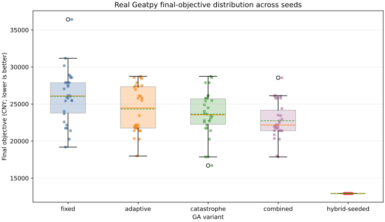
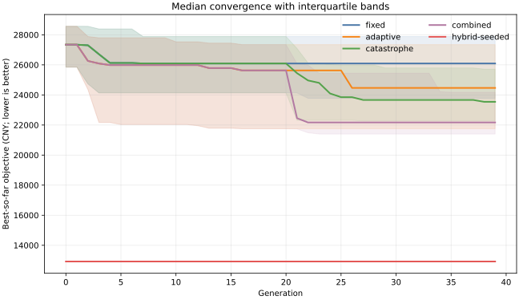
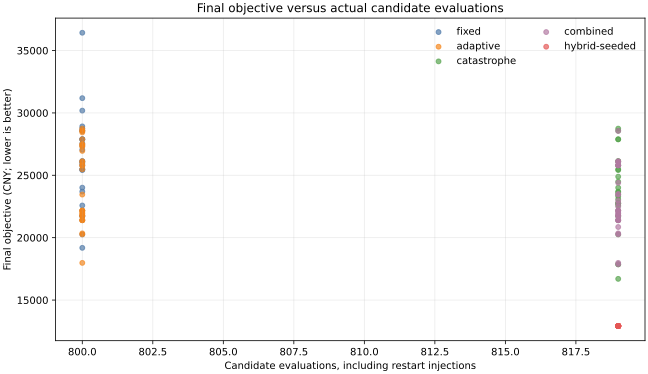
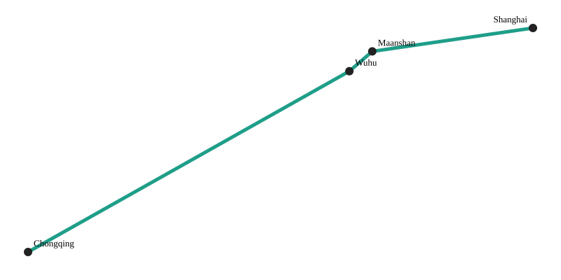

# 真实 Geatpy 实验结果、分析与可视化

实验日期：2026-09-27

## 1. 实验回答什么问题

本实验不是再次证明“代码能启动”，而是检验现代算法框架各部分在同一合成网络上的实际行为：

1. 贪婪规则将订单按 OD、截止时间和批次容量进行分批；
2. DFS 计算从起点可达的节点，拓扑排序验证有向网络的先后关系；
3. 目标函数同时计算运输、转运、时间窗和碳成本，并以 `风险权重 = 0.30` 组合期望成本与最坏情景成本；
4. 真实 Geatpy 2.7.0 分别运行固定参数、自适应、灾变、自适应+灾变以及图启发式初始化的混合版本。

这里“拓扑排序”的准确作用是验证和排列 DAG，不是生成连通图；实际可达性由 DFS 判断。订单分批在端到端管线测试中验证，本次消融只优化一个固定的 23 城网络情景，不把订单数量混入算法性能结论。

## 2. 实验设置

- 数据：明确标记为 `synthetic_calibrated` 的 23 城、754 条模式边网络；
- 连通性：DFS 可达 23/23 个节点，上海可达；网络是 DAG；
- 模式：公路、铁路、水路；
- 情景：高、中、低需求及其概率、速度和费率倍率；
- 目标：`E[C] + 0.30 × (max(C_s) - E[C])`；
- 搜索：20 个体、40 代、停滞 20 代触发灾变；
- 重复：每个变体使用相同的 30 个随机种子；
- 总运行：5 个变体 × 30 种子 = 150 次真实 Geatpy 求解；
- 环境：Python 3.10.21/x86-64、Geatpy 2.7.0、NumPy 1.26.4；
- 原始结果：[`results.json`](../benchmarks/geatpy-23city-ablation/results.json)；逐次摘要：[`runs.csv`](../benchmarks/geatpy-23city-ablation/runs.csv)。

删除非确定性计时字段后，以同一容器独立重跑一次，`results.json`、`runs.csv` 和四个 SVG 均得到完全相同的 SHA-256；因此保存结果可以字节级复验。

## 3. 汇总结果

| 变体 | 可行率 | 平均目标值 | 中位数 | 标准差 | 平均评价次数 | 相对 fixed 的同种子平均改善 | 胜/平/负 |
| --- | ---: | ---: | ---: | ---: | ---: | ---: | ---: |
| fixed | 100% | 26,045.29 | 26,091.34 | 3,519.71 | 800 | 0.00% | 0/30/0 |
| adaptive | 100% | 24,331.92 | 24,466.28 | 3,085.99 | 800 | 5.86% | 14/13/3 |
| catastrophe | 100% | 23,632.20 | 23,542.79 | 2,952.77 | 819 | 8.45% | 15/15/0 |
| combined | 100% | 22,745.52 | 22,168.21 | 2,405.34 | 819 | 11.46% | 22/6/2 |
| hybrid-seeded | 100% | 12,920.71 | 12,920.71 | 0.00 | 819 | 49.48% | 30/0/0 |

“改善”按同一个随机种子与 fixed 配对后计算，正值代表成本目标更低。灾变版本每次额外评价 19 个随机个体，因此 819 与 800 不是完全相同预算；增加量为 2.375%。报告同时展示质量和评价次数，不把额外搜索免费化。

## 4. 结果解释

### 自适应与灾变是否有效

- adaptive 在不增加评价次数的情况下，同种子平均改善 5.86%，但出现 3 次劣于 fixed，说明它不是逐次必胜。
- catastrophe 同种子平均改善 8.45%，30 次中 15 胜、15 平、0 负，但使用了额外 2.375% 评价。
- combined 的同种子平均改善为 11.46%，22 胜、6 平、2 负；目标值标准差比 fixed 低约 31.66%，在这组实验中表现出更好的平均质量和稳定性。
- 这些是一个合成网络上的描述性结果，没有统计显著性或跨实例泛化证明，不能写成算法普遍提高 11.46%。

### 图启发式初始化起了什么作用

随机初始化 GA 的所有变体都没有达到状态 Dijkstra 图启发式找到的 12,920.71。`hybrid-seeded` 将该路线编码为 Geatpy 的 prophet individual，再运行自适应+灾变 SEGA；30 次均保留了 12,920.71，因此相对 fixed 同种子平均改善 49.48%。

但 GA 在 40 代内没有继续改进这个初始路线。因此最严谨的结论是：**在本实例上，决定性收益来自图搜索提供的高质量初始解，遗传算法负责保留并继续探索，而不是遗传算子独立创造了 49.48% 改善。**这支持采用“图算法 + 遗传搜索”的混合框架，也暴露了纯随机高维优先级编码的搜索效率问题。

状态 Dijkstra 使用可加成本近似，也不是精确算法。12,920.71 仍然只是当前搜索找到的启发式结果，不是全局最优证明。

## 5. 最佳候选及情景分解

最佳候选来自 `hybrid-seeded`：

```text
Chongqing --water--> Wuhu --water--> Maanshan --water--> Shanghai
```

- 期望成本：9,815.91 CNY；
- 最坏情景成本：20,165.25 CNY；
- 鲁棒组合目标：12,920.71 CNY；
- 高需求情景：150 吨，64.56 小时，晚 2.56 小时，总成本 20,165.25 CNY，排放 3,137.71 kg；
- 中需求情景：85 吨，58.11 小时，总成本 4,538.30 CNY，排放 1,778.03 kg；
- 低需求情景：40 吨，53.80 小时，总成本 2,051.92 CNY，排放 836.72 kg。

时间窗在该实验中是软惩罚，所以高需求情景迟到仍然可行，其延误成本被计入目标。全水路路线没有换装成本；这只反映当前合成距离和参数，不应外推为现实中一定应选全水路。

## 6. 可视化

### 最终目标值分布



图中每个点是一组种子结果；箱线图展示中位数和离散程度。hybrid-seeded 的零方差来自所有运行均保留相同图启发式初始解。

### 收敛轨迹



实线为 30 次运行的中位最佳值，阴影为四分位区间。该图比较按代数推进的搜索行为；灾变版本的代内评价数略高，必须与下一张评价次数图结合阅读。

### 结果质量与实际评价次数



该图把灾变注入产生的额外评价明确画入横轴，避免只按代数比较造成不公平解释。

### 最佳候选路线



坐标来自合成网络配置，路线用于解释算法输出，不是精确地理底图或现实运输建议。

## 7. 可以和不可以得出的结论

可以说：真实 Geatpy 集成完成了 150 次受控运行；在这个固定合成网络上，combined 相对 fixed 的同种子平均目标改善为 11.46%，图启发式初始化进一步显著改善起始解和稳定性。

不能说：证明了全局最优；在所有网络上提高 11.46% 或 49.48%；处理了真实企业订单；实现了现实部署收益；2022 年原始代码已经包含这里的风险目标、图启发式 seed 或当前自适应公式。
