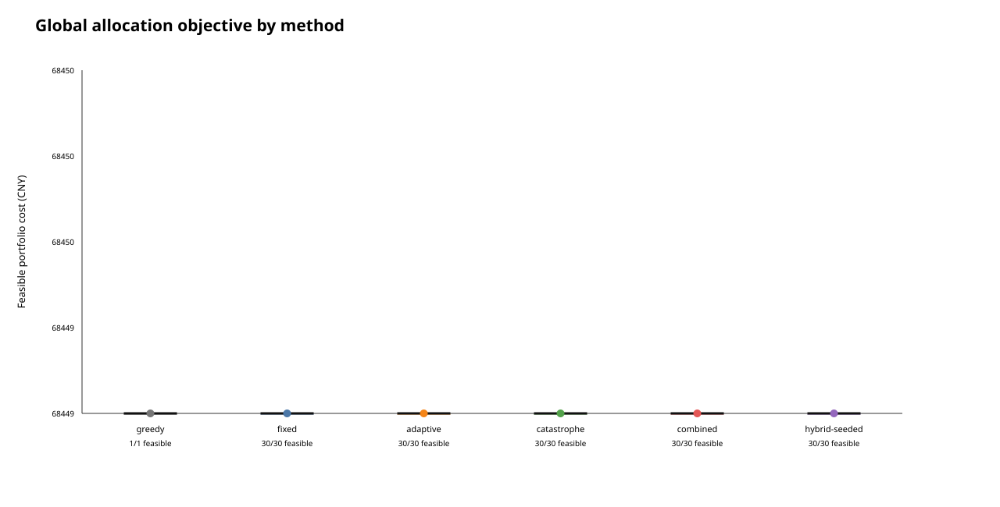
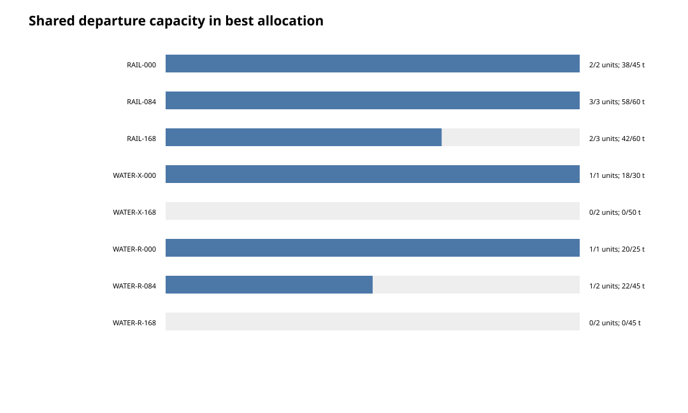
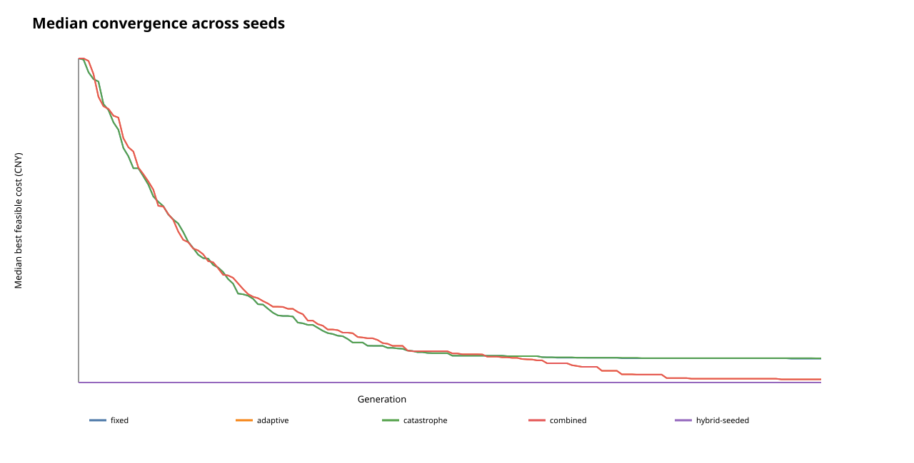
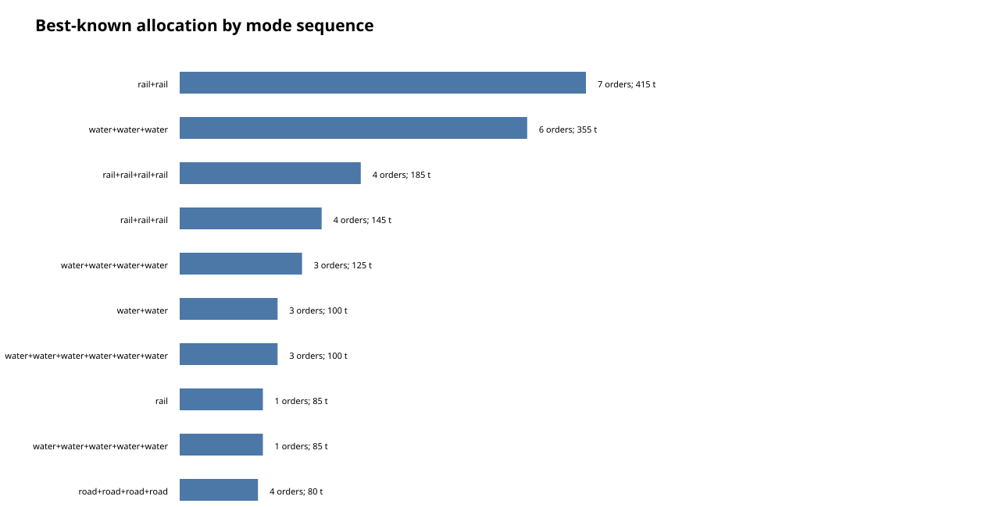
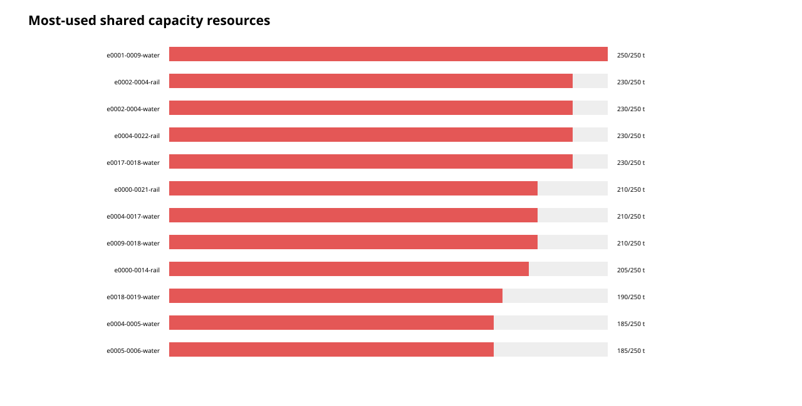

# 全局订单分配：实现、实验与证据边界

## 1. 为什么从单票寻路改为全局分配

三节点、五边的重庆果园港—上海洋山港设施图适合核对路线成本、时效和排放，但不适合证明遗传算法的必要性：单票只需在四条可选路线中择一，精确枚举或确定性最短路已经足够。

新实现把决策改为“一批订单共同争用有限班次/线路容量”。图搜索只为每个订单生成若干路线—班次候选，优化器同时决定所有订单的候选编号。某一订单占用便宜班次，会改变其他订单的可行域；累计排放还会共同跨越分段碳价阈值，因此不能再把订单逐票独立求解后简单相加。

## 2. 数学口径

订单 (i) 的染色体基因 (x_i\in\{0,\ldots,K_i-1\})，表示从该订单的候选池中选择一个不可拆分方案。目标为：

```text
min  Σ_i (运输成本_i + 换装成本_i + 等待成本_i + 延误成本_i)
     + CarbonCost(Σ_i 排放_i)
```

对每个共享资源 (r)：

```text
Σ_i tonnes_i · use(i, x_i, r) ≤ capacity_tonnes_r
Σ_i units_i  · use(i, x_i, r) ≤ capacity_units_r
arrival(i, x_i) ≤ deadline_i
```

[`allocation.py`](../routing/allocation.py) 统一计算这些约束。排序采用“约束违反优先、总成本其次、排放再次”的字典序；只有违反量为零才称为可行。碳成本对组合总排放调用一次分段积分，而不是每票重置首档。

## 3. 候选生成与五种GA

小图采用城市简单路线枚举；23城图采用有界 beam search。为避免低价水运挤掉所有公路兜底候选，公路、铁路、水运和混合方式分别搜索后去重合并。候选 beam 有上限，因此它不是全路径完备搜索，也不产生全局最优证明。

所有GA共用：

- 一订单一整数基因；
- 随机但不主动超订的容量可行初始化；
- 三元锦标赛选择；
- 连续片段交换；
- 按订单候选数取值的逐基因变异；
- 父代与子代合并后的精英保留。

五种方法的差别是：

| 方法 | 自适应概率 | 停滞灾变 | 启发式档案解 |
| --- | --- | --- | --- |
| fixed | 否 | 否 | 否 |
| adaptive | 是 | 否 | 否 |
| catastrophe | 否 | 是 | 否 |
| combined | 是 | 是 | 否 |
| hybrid-seeded | 是 | 是 | 是 |

正式实验使用第二版控制器。设第 (j) 个基因上出现最多的取值比例为 (f_j)，种群基因多样性为

```text
D = mean_j(1 - f_j)
u_D = max(0, (0.25 - D) / 0.25)
u_S = min(1, stagnant_generations / patience)
```

每个子代的期望变异基因数和交叉率为：

```text
E_mut = min(3.0, 1.25 + 0.75 u_D + 0.75 u_S)
pm = min(0.50, E_mut / n_orders)
pc = 0.72 + 0.13 max(u_D, u_S)
```

这使48基因个体的变异强度被解释为每个子代约1.25--2.75个基因（另设3.0硬上限），而不是旧控制器接近5个基因。连续30代无改进时，部分灾变保留排序靠前且互不重复的75%个体，只重新生成25%，避免全量重启摧毁已经形成的积木块。

`hybrid-seeded` 先用“机会损失”贪婪法求一个档案解：订单若失去稀缺的低成本共享资源，转用不共享资源的兜底方案会增加多少成本，就按该损失从高到低分配。该解只作为全局 incumbent，不替换随机初始种群，因此不会出现所有运行第一代都由同一贪婪个体锁定的假象；其平均288次候选检查单独报告。旧的适应度离散控制器、全量重启和 deadline 贪婪种子仍可复现实验对照，但不再是正式默认组合。这些公式均属于当前维护版工程设计，不追溯声称为未匹配到源码的2022精确控制器。

## 4. 实验A：设施级可审计微型案例

输入为 [`cq_shanghai_facility_scenario.json`](../data/allocation_instances/cq_shanghai_facility_scenario.json)：12个模型订单、239吨、8个共享班次。线路价格、距离和时间来自独立记录的设施校准层；订单、发车相位和可分配舱位是实验假设，不是真实订单、舱单或合同容量。

四订单子问题共有3,072种候选组合，已全部枚举并得到候选域内最优解。完整12订单实验中，贪婪和多数GA都达到 CNY 68,449.24。这个结果说明微型图仍然太容易，不能用来宣称GA优于基线；它的价值是逐项验证班次等待、容量占用、硬截止时间、累计碳价和结果可追溯性。





## 5. 实验B：23城多OD合成压力测试

规模层使用23个历史城市名称和历史汇总距离/方式分布作为校准锚点，但145条边、48个订单、23个OD组合及96个规划期容量全部是可重复生成的合成输入。这里的“线路容量”不带发车时间，避免虚构当前班次；它只表示算法压力测试中的共享资源上限。

固定预算为每次100个体 × 150代 = 15,000次GA候选评价，每种方法30个随机种子。`hybrid-seeded` 另有平均288次启发式候选检查。所有150次GA运行均找到可行分配。

| 方法 | 最佳成本 | 中位成本 | 平均成本 | 标准差 | 平均灾变次数 |
| --- | ---: | ---: | ---: | ---: | ---: |
| fixed | 309,974.93 | 324,683.26 | 323,955.47 | 8,141.37 | 0.00 |
| adaptive | 306,395.52 | 318,643.27 | 319,937.63 | 9,971.13 | 0.00 |
| catastrophe | 309,974.93 | 325,083.06 | 324,252.40 | 8,172.37 | 1.03 |
| combined | 306,395.52 | **318,643.27** | 319,875.05 | 9,933.01 | 0.37 |
| hybrid-seeded | **304,051.85** | 318,677.99 | **315,481.46** | **5,558.50** | 3.07 |

贪婪基线为 CNY 372,578.33；最佳已知GA为 hybrid-seeded、seed 17、CNY 304,051.85。以贪婪为分母，成本下降18.39%；换一种“贪婪相对最佳”的分母口径则为22.54%。必须同时写清分母，不能把两者混用。








hybrid 得到最低单次和平均成本、最低标准差；combined 的中位数低34.72元，差异极小。各方法分布仍然重叠，本实验不支持“hybrid 对每个种子都最优”。五订单前缀的7,776个候选组合得到精确解，只用于校验评价器；48订单结果仍是最佳已知启发式结果。

## 6. 控制器调参与独立验证

为避免直接在正式0--29种子上挑参数，机制选择使用种子30--39：比较12组旧控制器、不同变异上限、20/30代耐心值、25%/50%部分重启以及两种 hybrid。选择规则在运行前固定为“先最低中位数，再最低平均值，再最低最佳值”，选中 `v2-r25-p30-m3`。

随后在未参与选择的种子40--69上进行配对验证，预算仍为100 × 150：

| 新方法 vs 对照 | 胜/平/负 | 平均配对成本变化 | 近似95%区间 |
| --- | ---: | ---: | ---: |
| selected combined vs legacy combined | 18/0/12 | -CNY 3,760.23 | [-7,076.34, -444.11] |
| selected hybrid vs legacy hybrid | 23/0/7 | -CNY 6,414.15 | [-9,333.41, -3,494.89] |
| selected combined vs fixed | 19/0/11 | -CNY 5,106.09 | [-9,722.71, -489.46] |
| selected hybrid vs fixed | 25/0/5 | -CNY 8,854.71 | [-12,796.36, -4,913.05] |

这里的区间是30个配对差值的 t 近似区间，不是跨订单、跨网络或真实业务总体的置信保证。调参集、独立验证集和最后重新运行的正式种子集均保留原始CSV与JSON；完整说明见 [`ALLOCATION_CONTROL_TUNING_CN.md`](ALLOCATION_CONTROL_TUNING_CN.md)。

## 7. 可以与不可以怎样讲

可以有证据地说：维护版实现把单票路径搜索扩展为多订单共享容量分配；实现了贪婪、小规模精确枚举和五种GA；自适应与重启机制经过分离的调参与验证种子评估；在明确标注的23城合成压力测试中，最佳已知GA比分批贪婪低18.39%。

不能说：处理了48/10万条真实企业订单；恢复了真实铁路/水运舱位；证明了全局最优；部署后节省18.39%；或把当前工程公式倒述成2022比赛源码。2022贡献可以讲算法设计与项目代码，当前规模实验可以讲后续技术完善，但二者的证据年份和数据性质不能混淆。

## 8. 尚未伪造填补的中间层

理想的第二层是10–20个真实设施、多个真实OD和可核验班次容量的中型网络。当前公开资料清单虽已解析20个候选设施，但原始服务登记仍没有一条同时具备完整端点、距离、可比运价、班期容量和换装时间的可直接入模记录。因此本次没有把规划文件或“经过某城市”的新闻拼成伪造的中型运营网络。

后续只有在补齐运营方时刻表、订舱/舱位口径、真实订单分布或可合法使用的业务数据后，才应增加这层外部有效性实验。当前两层分别回答“评价器是否算对”和“全局耦合时GA是否有搜索价值”，不能替代真实运营验证。
