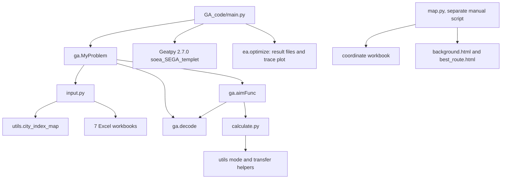

# 原始 GA_code 技术取证报告

审计日期：2026-09-27

证据源：`recovered-ga-code-2022-11-23`

证据基线：后来重写版仓库 HEAD `2f3551f4db70f79ca39471f2226676686c1caad8`；其主要实现提交为 `329d84ea50ed9b19169d410f596266c333531f12`。

## 一、结论先行

**代码确认：**恢复的 `GA_code` 是一套项目特有的 Python/Geatpy 多式联运路线成本搜索代码。它把 23 个城市扩展为公路、铁路、水路三层共 69 个节点，以 69 维整数“节点优先级”向量贪心解码路线，计算运输、转运、时间窗惩罚和碳排成本，并把四项相加为一个单目标。

**最关键的纠正：**当前入口保存了 `NIND=100000`、`MAXGEN=1`，但 `MAXGEN` 是可修改的实验参数，不能据此判断算法是否完整或否定历史运行。Geatpy 2.7.0 的 SEGA 模板包含锦标赛选择、两点交叉、Breeder GA 变异和父子合并精英保留的完整循环。[`main.py` 18-29](../historical/GA_code/main.py#L18)；第三方模板不属于个人实现，但项目对模板的配置、问题定义、解码和目标函数属于项目代码。

**历史运行确认：**两份2022终端产物均记录 `generation_index=99`、`reported_evaluations=100000`；答辩文档明确写明100轮迭代，并内嵌与输出目录文件哈希完全相同的100代 trace 图。因此，多代遗传算法确实运行过。答辩文档同时记录了自适应交叉/变异和“20代最优值不变时注入随机个体”的实现说明。当前七文件快照没有包含该自定义控制器，正确结论是“精确源码修订尚未匹配”，而不是“2022年没有实现或运行”。

**运行验证：**在 `/tmp` 中用路径重定向和仅包含 `ea.Problem` 构造器的最小桩加载未改动的源文件，使用已找到的 11 月工作簿，成功复算“重庆—水—九江—铁—安庆—铁—上海”：运输成本 9,618.65 元、转运成本 500 元、时间 61.2667 小时、运输/转运排放 3,069.6/11.3 kg、碳成本 154.045 元、浮点总成本 10,272.695 元。这与最终材料显示的分项和 10,272.69 元结果一致。该验证没有模拟 Geatpy 的进化过程。

**仍未知：**没有精确的 2022 Python、NumPy、Pandas、Folium、Matplotlib 和 XLSX 引擎版本，没有随机种子，也没有可证明与每一份终端日志对应的代码/数据组合。Geatpy 版本可确认为 2.7.0，但归档的原生模块只覆盖 Windows/Linux x64 CPython 3.6。

## 二、证据等级

- **代码确认**：直接来自字节级快照或归档第三方框架代码。
- **运行验证**：在临时目录中对未改动项目函数做过调用验证。
- **文档声称**：来自 final presentation、semifinal report、routing defense 或 comparison notes。
- **合理推断**：多个证据相互支持，但缺少直接配置或运行环境记录。
- **仍未知**：现有证据不能确定。

## 三、恢复文件与身份

完整逐文件哈希、大小、编码、引用方和依赖见 [`historical/FILE_MANIFEST.json`](../historical/FILE_MANIFEST.json)。`GA_code` 只有 7 个文件；没有隐藏文件、notebook、Matlab、配置、日志、图片、压缩包或包源码。

| 文件 | 角色 | 是否被执行路径引用 |
| --- | --- | --- |
| `main.py` | Geatpy 入口、搜索规模、输出 | 是，人工运行入口 |
| `ga.py` | `MyProblem`、图构建、解码、单目标评价 | 是，由 `main.py` 导入 |
| `input.py` | 距离与 6 个参数工作簿加载 | 是，由 `ga.py` 导入 |
| `calculate.py` | 四类成本/排放/时间公式 | 是，由 `ga.py` 导入 |
| `utils.py` | 换装计数、方式识别、城市编号、字符串边解析 | 是，由多个模块导入 |
| `map.py` | 独立 Folium 地图生成脚本 | 否，优化器不导入 |
| `readme.txt` | “所有代码，没带算例数据” | 2026 恢复说明，不是 2022 代码 |

六个 Python 文件中的 `D:\SODA\...` 是历史 Windows 路径。当前证据源中的真实文件分散在 11 月目录，原样运行会因路径失效而失败。快照保留这些文字作为历史证据；当前私有来源绝对路径不进入公开仓库。

## 四、真实调用链



执行顺序是：构造 `MyProblem` → 读距离表并建 69 个邻接列表 → 读参数表 → Geatpy 初始化种群 → `aimFunc` 逐个解码并计算四项成本 → 在 `MAXGEN` 允许的代数内执行选择、交叉、变异、评价和精英保留 → 保存结果与 trace → `main.py` 再解码最优染色体并打印数字城市路径。当前文件中的 `MAXGEN=1`只代表该保存配置；历史100代产物来自其他参数状态或源码修订。[`ga.py` 22-59](../historical/GA_code/ga.py#L22)，[`ga.py` 87-105](../historical/GA_code/ga.py#L87)，[`main.py` 18-45](../historical/GA_code/main.py#L18)

`map.py` 不接收优化器输出。它独立读取经纬度工作簿，硬编码最终路线坐标、方式、距离和说明文字后保存 HTML。[`map.py` 128-184](../historical/GA_code/map.py#L128)

## 五、数据加载、工作表和预处理

所有被加载工作簿均只读 `Sheet1`，没有公式单元格。

| Source ID | 实际读取列 | 单位/类型 | 代码处理 |
| --- | --- | --- | --- |
| `distance-network` | 起点、终点、公路距离、铁路距离、水路距离 | 城市字符串；km 数值；`#` 表示不可用 | 去掉城市名空格；按城市层生成字符串边键；`int()` 距离 |
| `parameters-transport` | 平均速度、运行基价 1/2/3、单位碳排放量 | km/h、CNY/(km·t)、kg/(km·t) | 固定取前 3 行，按公/铁/水顺序组成 tuple |
| `parameters-transfer` | 转运时间、转运碳排系数、转运成本 | h/1000t、kg/t、CNY/t | 固定取公铁、公水、铁水三行 |
| `parameters-time-cost` | 单位仓储、单位惩罚成本 | CNY/(h·t) | 取第 1 数据行 |
| `parameters-window` | 最短时间、最长时间 | h | 取第 1 数据行 |
| `parameters-carbon` | 碳排放量阈值、碳税率 | kg、CNY/kg | 取四档 |
| `parameters-demand` | 运货量、概率 | t、无量纲 | 被加载为 `Q`/`P`，但目标函数不用 |
| `transfer-coordinates` | 城市名称、纬度、经度 | 字符串、十进制度 | 仅 `map.py` 使用 |

距离表存储范围是 `A1:F522`，但只有 254 个非空行：1 个表头和 253 个城市对。23 个城市正好有 253 个无序对；表中每对只保留一个方向，没有反向行。公路 253 条均可用，铁路 250 条、水路 251 条。代码把它们直接当有向边，因此图是从表中“起点”指向“终点”的上三角式有向图，而不是自动双向图。[`input.py` 22-41](../historical/GA_code/input.py#L22)

经纬度表有 25 个城市数据行，比分路由网络多 2 个；地图背景也将所有坐标两两连线，而不是读取距离表的可用边。它不能作为路由图的精确可视化。

代码没有实现 semifinal report 声称的 MAD 异常值处理、随机插值、中位数填充或哑变量转换。实际预处理只有去空格、跳过 `#` 和数值转换。[`utils.py` 46-70](../historical/GA_code/utils.py#L46)，[`input.py` 28-40](../historical/GA_code/input.py#L28)

## 六、对 18 个算法问题的逐项回答

### 1. 染色体/个体如何编码？

**代码确认：**一个个体是 69 维整数向量；每个基因取 0 到 68，允许重复，不是排列编码。69 = 23 城市 × 3 方式。基因值不是“边是否选择”，而是相应扩展节点作为下一目的节点时的优先级分数。[`ga.py` 22-34](../historical/GA_code/ga.py#L22)

### 2. 城市、边、运输方式和换装节点如何表示？

- 城市基础编号为 0..22；重庆强制为 0，上海强制为 22，其他城市通过 `list(set(cities))` 分配，受 Python 哈希随机化影响。[`utils.py` 46-70](../historical/GA_code/utils.py#L46)
- 扩展节点 0..22 是公路，23..45 是铁路，46..68 是水路。[`utils.py` 34-43](../historical/GA_code/utils.py#L34)
- 同方式边是 `(source + layer_offset, destination + layer_offset)`；距离字典用该 tuple 的字符串表示作键。[`input.py` 28-40](../historical/GA_code/input.py#L28)
- 没有显式换装节点或跨层边。相邻两条运输边的源节点落在不同层时，代码把它视为一次方式转换。[`utils.py` 19-31](../historical/GA_code/utils.py#L19)

### 3. 染色体如何解码成路线？

从基础城市 0 开始。对当前城市，分别取公/铁/水层所有可达目的节点，在每一层选基因优先级最高者，再在三层候选中选最高者；把目的扩展节点减去层偏移得到下一个基础城市。到基础城市 22 时停止。[`ga.py` 61-85](../historical/GA_code/ga.py#L61)

这是逐步贪心解码，不是遍历所有路径，也不是拓扑排序算法本身。相同目的扩展节点的优先级会被多个不同起点共享，所以编码不是“每条边一个独立优先级”。

### 4. 无效路线、重复节点、断路和不可达如何处理？

**代码确认：没有处理。**恢复版 `decode()` 没有 visited 集、回溯、修复、最大步数、断路检查或重复节点检查。若某城市三种方式均无后继，`chooseNode` 保持 -1，代码仍继续；可能产生负索引、错误边、异常或死循环。最终 `aimFunc()` 也没有截图旧版中的“edge key 不存在则抛错”检查。[`ga.py` 61-100](../historical/GA_code/ga.py#L61)

在已找到的 23 城市完整上三角公路网络中，每个非终点至少有向后的公路边，因此通常可到上海。这是数据结构降低了故障概率，不是通用可行性处理。

### 5. 目标函数包含哪些项目？

**运输成本 C1：**对每条腿分别按距离 `<500`、`500..999`、`>=1000` km 选择运输基价档，再计算 `q × distance × rate(mode, band)` 并求和。[`calculate.py` 19-32](../historical/GA_code/calculate.py#L19)

**转运成本 C2：**理论形式是 `q × Σ(count_pair × CN_pair)`，但实现先调用 `get_transit_num()` 计数一次，又在 `transit_cost()` 内重复计数一次，导致每次换装被算两遍。[`calculate.py` 35-47](../historical/GA_code/calculate.py#L35)

**时间成本 C3：**运输时间 `Σ(distance / speed)`；换装时间 `q/1000 × Σ(count_pair × T2_pair)`；早到仓储与延误惩罚为 `q × [P1 max(Ta-time,0) + P2 max(time-Tb,0)]`。[`calculate.py` 50-60](../historical/GA_code/calculate.py#L50)

**排放与碳成本 C4：**运输排放 `q × Σ(distance × EM_mode)`；换装排放 `q × Σ(count_pair × MIU_pair)`；总排放进入分段税率“速算扣除数”公式。[`calculate.py` 63-87](../historical/GA_code/calculate.py#L63)

**已确认 bug：**只有第一档能正常运行。进入第二至第四档时，代码在空的 `Yk` 上先访问 `Yk[-1]`，会抛 `IndexError`。100 吨案例约 3,081 kg，位于第一档，因此未触发。

没有单独的仓储库存过程、容量成本、道路收费、班次成本或其他大 M 惩罚。仓储只作为早于 `Ta` 的时间成本。

### 6. 单一目标、加权目标还是多目标？

**单一标量最小化目标。**`M=1`、`maxormins=[1]`，目标直接是 `C1+C2+C3+C4`，没有归一化或可调权重。[`ga.py` 24-34](../historical/GA_code/ga.py#L24)，[`ga.py` 87-100](../historical/GA_code/ga.py#L87)

PPT 所称“成本、时间、碳排 3 个优化目标”与此实现不一致；代码把时间和排放货币化后并入一个成本目标。

### 7. 时间窗和排放约束如何处理？

时间窗是软惩罚：早于 `Ta` 收仓储费，晚于 `Tb` 收延误费，迟到路线仍可行。排放没有硬上限；它只通过碳成本进入目标。`pop.CV` 全部初始化为 0，之后从未修改，所以 Geatpy 把所有已解码个体视为可行。[`ga.py` 87-100](../historical/GA_code/ga.py#L87)

最终材料中的“至少降低 15% 排放”不在这份 `GA_code` 中实现。

### 8. 不确定需求、情景概率和鲁棒性是否进入代码？

**没有。**`input.py` 把三组 `Q=(150,85,40)` 与 `P=(0.36,0.50,0.14)` 读入 `args`，但 `ga.py` 将 `self.qt` 固定为 100，四个成本函数只接收该固定值；`Q` 和 `P` 后续无人读取。[`ga.py` 50-58](../historical/GA_code/ga.py#L50)，[`input.py` 88-93](../historical/GA_code/input.py#L88)

没有正态重采样、期望值、最坏情景、CVaR、鲁棒预算或 `C_s(x) <= (1+α)C_s*` 约束。semifinal report 中的情景公式是文档模型，不是这份代码的数据流。

### 9. 选择、交叉、变异使用什么算子？

项目代码只实例化第三方 `ea.soea_SEGA_templet`，没有自定义算子。归档 Geatpy 2.7.0 模板对 RI 编码配置：锦标赛选择 `tour`、两点交叉 `Xovdp(XOVR=0.7)`、breeder GA 变异 `Mutbga(Pm=1/Dim, MutShrink=0.5, Gradient=20)`；父子合并后用 `dup` 按适应度直接复制保留。

当前保存参数为 `MAXGEN=1` 时不会进入后续繁殖循环；将参数设为100时会执行这些算子。历史第99代日志和trace证明多代配置实际运行过，因此不能把当前默认值扩大成历史算法缺失。

### 10. “自适应交叉/变异”的真实公式是什么？

**当前七文件快照中没有该公式，但同期答辩文档保存了公式图。**`routing-defense` 记录：

```text
p_c = k1*p'_c + p'_c + (F' - F_avg)/(k2*F')
p_m = k2*p'_m + p'_m + (F' - F_avg)/(k3*F')
```

图片没有完整给出变量定义、常数取值或边界处理，当前快照也没有对应控制器。因而可以有证据地说“2022年设计并在答辩中说明了自适应公式”，但要逐项复原精确数值行为仍需找到匹配源码或补齐变量定义。

### 11. 连续 20 代未改进后的灾变/重启是否实现？

**同期答辩材料明确记录已实现：**最优解连续20代不变时向种群加入随机个体，以增加多样性。当前七文件快照没有停滞计数、注入或替换比例，因此尚不能从该快照还原究竟替换多少个体。Geatpy父类的通用停滞终止不是灾变，不能拿它代替项目机制。

### 12. 种群规模、代数、随机种子、终止条件和评价次数

- 当前保存配置：种群100,000，`MAXGEN=1`，未显式设置随机种子。
- 历史运行产物A/B：代数索引99、累计评价100,000，与100代运行一致；若每代完整评价等量个体，则对应约1,000个体，但精确配置仍需匹配源码/日志格式确认。
- 答辩说明：23节点案例设置100轮迭代，约5秒完成，并在约20代收敛；这是同期实验记录，不是当前机器重新计时结果。
- Geatpy还支持时间、评价数、停滞等终止条件；当前项目入口只显式传入 `MAXGEN`。

[`main.py` 20-29](../historical/GA_code/main.py#L20)

### 13. 最优个体、适应度和约束违反如何排序？

项目设置单目标最小化；Geatpy 依据 `ObjV` 和全零 `CV` 计算适应度，`SoeaAlgorithm.stat()` 取最大适应度者为 `BestIndi`。没有项目自定义排序、罚函数或多目标非支配排序。所有个体 `CV=0`，所以没有真实的约束违反比较。

### 14. 是否有精英保留？

有。Geatpy 的 SEGA 模板是增强精英保留算法：每代合并父子共2N个体，再用 `dup` 选择N个进入下一代。当前保存的单代参数不会触发该循环，但历史100代运行会使用模板的精英保留机制；灾变时具体保留多少精英仍未由当前快照确认。

### 15. 路线、成本、时间、排放、地图和日志如何产生？

- `aimFunc()` 对每个候选打印两行：总成本/时间/排放与四项成本。[`ga.py` 101-105](../historical/GA_code/ga.py#L101)
- Geatpy 输出代日志、trace 图、`result` 目录中的问题/算法/种群/结果文件；`saveFlag=True`、`drawing=1`、`drawLog=True`。[`main.py` 22-29](../historical/GA_code/main.py#L22)
- `main.py` 打印 `city2id`、最低成本、数字城市路径和每腿“公/铁/水”。没有把数字映射回城市名，也没有 JSON/CSV。
- `map.py` 单独运行并硬编码两条方案的坐标与标签，不读取最优染色体或 `result` 文件。

### 16. 能否证明全局最优？

不能。它是遗传启发式结果，没有穷举、下界、最优性 gap、精确求解器对照或已保存随机种子。“最优”只能解释为某次搜索中找到的最佳候选，不能写成已证明的全局最优。

### 17. 与 PPT、答辩、Excel 和 terminal 输出的一致/不一致

**一致：**

- Python/NumPy/Geatpy、RI 整数优先级编码、单目标 `MyProblem` 结构均得到代码确认。
- 23 城市 × 3 方式 = 69 维得到代码和工作簿确认。
- 四项成本和 100 吨重庆—九江—安庆—上海案例分项得到运行复算。
- 运输距离实际为水路 1543 km、铁路 194 km 和 96 km；由此精确得到 9,618.65 元运输成本。

**不一致：**

- PPT/答辩与终端日志共同确认多代运行；答辩记录自适应和灾变实现，但对应自定义控制器未保存在当前七文件快照。鲁棒情景仍未得到可执行数据流确认。
- semifinal 页面把图例“Average Objective Value / Best Objective Value”的单次 trace 图描述成“灾变自适应 vs 普通 GA”，不能支持 23% 加速结论。
- 终端日志的 `99 | 100000` 表明某旧配置约为 100 代、总评价 10 万；恢复入口则是 1 代 × 10 万。日志来自不同修订/配置，不能当作此入口的直接运行记录。
- 另一份示例日志为 5,000 代、20,000 次评价，且尾部追加了不同目标值，也不是本入口。
- `map.py` 把安庆—上海铁路距离写成 487 km，但被加载距离表为 96 km；成本和时间分项使用的是 96 km。
- 参数表铁水转运单价为 2.5 CNY/t，按一次应为 250 元；`transit_cost()` 的重复计数使其变成材料中的 500 元。这是实现 bug 与历史结果的对应，不应静默“修正”。
- 旧截图注释仍写 15 城市/45 节点，且旧 `aimFunc` 只累加边成本；恢复代码是 23/69 节点和四项成本，说明截图来自较早修订。

### 18. 哪部分自写，哪部分来自第三方？

**Jingfan Xin 的项目实现：**本人确认其编写了2022年项目代码并设计路径规划算法，包括 `ga.py` 的问题建模/解码/目标调用、`input.py` 的项目工作簿读取、`calculate.py` 的项目公式、`utils.py` 的层编号与辅助函数、`main.py` 的配置和输出以及 `map.py` 的路线展示；一名队友共同参与数据收集。该个人贡献边界不包含团队其余平台模块。

**第三方：**Geatpy 的 Problem/Population/SEGA、初始化、适应度缩放、选择、交叉、变异、日志、绘图与结果保存；NumPy、Pandas、Folium/Leaflet、Amap 瓦片；参考项目和示例代码。它们不得计入个人原创代码。

## 七、已确认缺陷和限制

1. 当前保存入口的 `MAXGEN=1` 与100代历史产物不一致；必须记录为配置/版本匹配缺口，不能再解释为算法未实现。
2. 无随机种子；城市 ID 又由无序 `set` 生成，跨进程不稳定。
3. 转运成本重复计数，时间和排放只计一次。
4. 碳成本第二档及以上会 `IndexError`。
5. 场景数量/概率被加载但未使用。
6. `CV` 恒为 0；没有硬约束。
7. 解码器无回溯、去环、断路和最大步数保护。
8. 图只有工作簿中单向边，未自动补反向。
9. 地图与求解器解耦并含硬编码距离错误。
10. 入口会打印约 20 万行候选信息并保存绘图/结果，资源开销大。
11. 没有单元测试、异常处理、CLI 参数或数据模式校验。
12. 没有历史依赖锁、随机状态和完整 run metadata。

## 八、安全运行与复现记录

原始 SODA 目录没有执行任何脚本，也没有创建缓存或解压文件。全部转换、依赖安装和验证在 `/tmp/soda-ga-recovery-20260927` 完成。

| 检查 | 结果 |
| --- | --- |
| 六个 Python 文件语法解析 | CPython 3.13 下通过 |
| 当前平台安装 NumPy/Pandas/openpyxl/Folium | 临时 venv 成功 |
| 当前 PyPI 安装 `geatpy==2.7.0` | 失败；索引最高显示 2.4.0 |
| 加载原工作簿 | 路径重定向后成功 |
| 构造 `MyProblem` 和调用未改动成本/解码函数 | 最小 `ea.Problem` 桩下成功 |
| 复算最终 combined 路线 | 分项和目标值一致 |
| 完整原样 Geatpy 搜索 | 未运行；缺少兼容 CPython 3.6 x64/Geatpy 环境 |
| 历史终端日志逐字复现 | 未完成；日志对应的代码配置与恢复入口不一致 |

兼容层 [`compatibility/run_original.py`](../compatibility/run_original.py) 只重定向工作簿路径，运行字节级原入口；它明确要求 Geatpy 2.7.0 并把所有输出写到用户指定的临时目录。依赖边界见 [`historical/DEPENDENCIES.md`](../historical/DEPENDENCIES.md)。

## 九、可辩护的项目/CV 表述

可以有证据地写：

- “Built a Python/Geatpy prototype for 23-city road/rail/inland-water route evaluation using a 69-variable priority encoding.”
- “Implemented transport, transfer, delivery-window and progressive carbon-cost accounting for route candidates.”
- “Reproduced a 100-tonne Chongqing–Shanghai case at CNY 10,272.695, 61.27 h and 3,080.9 kg modelled emissions under the archived assumptions.”
- “Worked on a team project that received Third Prize in the 2022 Shanghai Open Data Innovative Application Competition.”

必须加边界或不能使用：

- 可以说本人在2022年设计并实现了答辩所述自适应/灾变GA，并保留100代运行证据；严谨技术说明应补充“精确自定义控制器源码修订尚未与当前快照匹配”。鲁棒情景优化仍不能当作已确认的可执行实现。
- 不能说“提升寻优速度 23%”；没有匹配算法、预算、硬件和计时的基准。
- 不能把启发式样本最优写成 global optimum。
- 不能把 64% 成本/65% 排放写成部署收益；它们是历史模拟/展示对比，且基线未恢复。
- 不能声称处理百万级真实数据、实时 GPS/区块链生产数据或上线政府平台。
- 不能把 Geatpy 算子、框架代码或整个团队成果归为个人独立实现。
