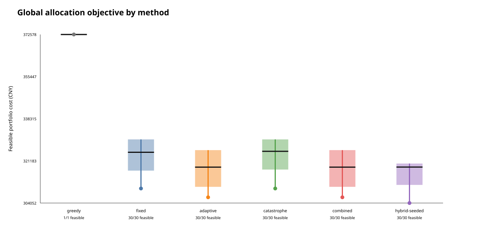

# Carbon-Aware Multimodal Freight Routing

## A reproducible optimization and scenario-analysis report

Report date: 28 September 2026

## Abstract

This project studies how freight orders can be assigned to road, rail and inland-waterway services when cost, delivery time, shared capacity and carbon emissions matter simultaneously. The original competition prototype represented 23 corridor cities in three transport layers and used a Python/Geatpy genetic algorithm to search for one Chongqing--Shanghai route. The maintained system extends that idea to global order allocation: each gene selects one route candidate for one order, while all orders jointly consume capacity and contribute to a portfolio-level carbon charge or hard emissions cap.

The main synthetic experiment contains 48 orders, 2,055 tonnes, 23 origin--destination pairs, 145 directed mode edges and 96 shared capacity resources. Five genetic-algorithm variants were evaluated over 30 random seeds under a common budget. The best formal run cost CNY 324,492.36, 18.52% below the deadline-greedy baseline. A separate policy matrix compared road-only, no-transfer and multimodal-enabled allocation under progressively tighter emissions limits. The best-known multimodal portfolio was 47.95% cheaper and 54.28% lower-emitting than the synthetic road-only counterfactual, but required longer transit time. These are controlled model results, not measured operating savings.

The most important analytical lesson is that objective design, constraints and reference cases matter more than a single headline percentage. The project therefore reports feasibility, distributions across seeds, sensitivity to emissions targets, exact checks on small subsets and explicit data limitations.

## 1. Decision problem

### 1.1 Operational question

For each order, the planner must choose a feasible route and transport-mode sequence. Orders may share rail or water capacity, face different release times and deadlines, and contribute jointly to a progressive carbon-cost schedule. A locally cheap route can therefore be globally poor if it consumes scarce capacity needed by another order.

For order `i`, gene `x_i` selects one candidate from its bounded candidate set. The portfolio objective is:

```text
min  sum_i noncarbon_cost(i, x_i)
     + CarbonCost(sum_i emissions(i, x_i))
```

The non-carbon term contains transport, transfer, scheduled waiting and lateness costs. The progressive carbon function is applied once to aggregate portfolio emissions rather than reset for every shipment.

The principal constraints are:

```text
arrival(i, x_i) <= deadline(i)
sum_i tonnes(i) * use(i, x_i, resource) <= resource tonne capacity
sum_i units(i)  * use(i, x_i, resource) <= resource unit capacity
sum_i emissions(i, x_i) <= portfolio emissions cap      [optional]
```

Solutions are ranked lexicographically by normalized constraint violation, total cost and emissions. This feasibility-first rule prevents a cheap but invalid portfolio from being reported as the answer.

### 1.2 Decision outputs

The model produces:

- one route and mode sequence per order;
- portfolio cost and its transport, transfer, waiting, lateness and carbon components;
- emissions, transport work and emissions intensity;
- arrival time and deadline status;
- shared-capacity use and excess;
- the number and tonnage of road-only, rail-only, water-only and multimodal assignments;
- method-level feasibility, convergence and cost distributions across seeds.

## 2. Data and evidence boundary

Three data layers are kept separate.

| Layer | Purpose | Evidence boundary |
| --- | --- | --- |
| Historical competition inputs | Preserve the original 23-city concept, transport parameters and reported outputs | Public Shanghai data did not provide a complete interprovincial operating network; the team collected corridor-specific distances and parameters for one Chongqing--Shanghai example |
| Facility-calibrated corridor | Test realistic route economics for Guoyuan, Luchaogang and Yangshan | Combines public/operator disclosures, team-collected distances and explicitly labelled assumptions; it is not a carrier contract or booking dataset |
| Synthetic 23-city portfolio | Stress-test global allocation and algorithm behaviour | City names and aggregate ranges are historical anchors, but the 48 orders, 145 edges and 96 planning capacities are deterministic synthetic model inputs |

The project does not contain a large enterprise order table. Synthetic orders are useful for controlled experiments but must not be described as collected transactions. Likewise, route prices and emissions factors are model inputs with different evidence strengths, not a unified audited market dataset.

The author contribution was the routing and quantitative-analysis workflow: graph representation, priority encoding, objective construction, genetic-search integration, result analysis and visualization. Corridor data collection was shared with a teammate, and the wider information-sharing platform was a team deliverable. Geatpy supplied the third-party evolutionary template and standard operators; it is not personal implementation.

## 3. Solution approach

### 3.1 Competition-stage route model

The competition model expanded 23 cities into 69 city--mode nodes. A 69-integer chromosome assigned priorities to those nodes. Starting from Chongqing, the decoder selected the highest-priority reachable successor until it reached Shanghai or failed. The objective combined transport, transfer, time-window and carbon costs.

The executable fitness used one fixed 100-tonne demand. Although scenario values were loaded, they did not enter the evaluated objective. The original executable should therefore be described as a fixed-demand heuristic route model, not as a stochastic or robust optimizer. The custom route representation and objective were project-specific; selection, crossover, mutation and the evolutionary loop were executed by Geatpy.

The defence material records a baseline and an improved design with fitness-dependent crossover and mutation plus random-population injection after 20 unchanged generations. However, the byte-exact historical snapshot does not contain that custom controller. The current adaptive formula and partial-restart implementation are tested extensions and are not backdated as the missing historical source revision.

### 3.2 Candidate generation and global allocation

The maintained allocator separates route generation from portfolio optimization. Small graphs enumerate city-simple routes. The 23-city graph uses bounded, mode-diverse beam search. Candidate retention protects the cheapest, fastest, lowest-emission, capacity-independent and mode-diverse alternatives. This avoids discarding a route that becomes important only under a hard emissions cap, although bounded generation still cannot prove that every physical path was considered.

The allocation chromosome has one integer gene per order. All five GA variants use:

- capacity-aware randomized initialization;
- ternary tournament selection;
- contiguous-segment crossover;
- candidate-aware integer mutation;
- parent--offspring merging with elite retention;
- the same low-emission constraint seed when a hard cap is active.

The five variants isolate specific mechanisms:

| Method | Adaptive rates | Partial restart | Opportunity-loss archive |
| --- | --- | --- | --- |
| Fixed | No | No | No |
| Adaptive | Yes | No | No |
| Catastrophe | No | Yes | No |
| Combined | Yes | Yes | No |
| Hybrid-seeded | Yes | Yes | Yes |

Adaptation responds to genotype diversity and stagnation. For the selected 23-city hybrid, expected mutations per child are:

```text
D   = mean locus impurity
u_D = max(0, (0.25 - D) / 0.25)
u_S = min(1, stagnant generations / 30)

expected mutations = min(2.5, 1.0 + 0.75*u_D + 0.75*u_S)
crossover probability = 0.72 + 0.13*max(u_D, u_S)
```

After 30 generations without improvement, catastrophe-enabled methods preserve ranked unique elites and regenerate 25% of the population. The hybrid additionally keeps an opportunity-loss greedy assignment in an external archive. This distinguishes an initialization advantage from improvement produced by crossover and mutation.

### 3.3 Experimental controls

Controller selection used seeds 30--39. Paired validation used untouched seeds 40--69. Final reported runs used seeds 0--29. Every formal method used 100 individuals and 150 generations, or 15,000 GA candidate evaluations per seed. A five-order prefix was exhaustively checked over 7,776 assignments, but the full 48-order problem remains heuristic.

## 4. Experimental design

Four experiments answer different questions.

1. **Evaluator check.** Twelve model orders share eight timed resources on a three-node/five-edge facility graph. A four-order subset has 3,072 combinations and is solved exactly. This tests arithmetic and constraints, not GA superiority.
2. **23-city algorithm comparison.** Forty-eight orders compete for 96 shared resources. Five GA variants use 30 seeds each and are compared with deadline-greedy allocation.
3. **Objective and transport-policy matrix.** The same portfolio is evaluated under road-only, single-mode-per-order and multimodal-enabled candidate policies, with 20%, 40%, 55% and 60% hard reductions relative to the road-only counterfactual. This contains 1,200 formal GA runs.
4. **Facility-calibrated policy analysis.** A Guoyuan--Luchaogang--Yangshan graph tests deadline, demand, carbon-price and hard-cap sensitivity using corridor-specific route economics. The formal boundary experiment contains 1,800 GA runs.

The experiments deliberately separate arithmetic validation, search performance, transport-policy effects and external plausibility. Combining them into one headline metric would obscure what each result actually demonstrates.

## 5. Results

### 5.1 Search performance on the 23-city portfolio

All 150 formal GA runs found capacity- and deadline-feasible solutions.

| Method | Best cost | Median cost | Mean cost | Standard deviation |
| --- | ---: | ---: | ---: | ---: |
| Fixed | CNY 328,144 | CNY 344,708 | CNY 343,768 | CNY 7,830 |
| Adaptive | CNY 324,593 | CNY 338,252 | CNY 338,272 | CNY 9,287 |
| Catastrophe | CNY 328,144 | CNY 344,883 | CNY 343,888 | CNY 7,721 |
| Combined | CNY 324,593 | CNY 338,252 | CNY 338,378 | CNY 9,421 |
| Hybrid-seeded | **CNY 324,492** | **CNY 337,472** | **CNY 333,376** | **CNY 5,044** |

The deadline-greedy baseline cost CNY 398,224.22. The best formal hybrid run cost CNY 324,492.36, 18.52% lower using greedy as the denominator. Hybrid had the lowest mean, median and dispersion in the final table, but distributions overlapped and no method won every seed.

On held-out seeds, the selected hybrid beat the legacy hybrid in 23 of 30 paired runs. The mean paired cost change was -CNY 4,257.77, with an approximate 95% interval of [-6,305.60, -2,209.93]. This supports the controller on one fixed synthetic instance; it does not establish universal algorithm superiority.



### 5.2 Transport policy and emissions targets

The road-only reference was fixed before evaluating the emissions caps.

| Policy | Best-known cost | Emissions | Tonne-weighted transit time |
| --- | ---: | ---: | ---: |
| Road-only | CNY 618,893.09 | 217,720.96 kg | 18.65 h |
| Single-mode-per-order | CNY 332,353.03 | 104,025.60 kg | 42.04 h |
| Multimodal-enabled archive | CNY 322,104.18 | 99,543.59 kg | 43.23 h |

Relative to road-only, the best-known multimodal portfolio was 47.95% cheaper and 54.28% lower-emitting, but its weighted transit time was substantially longer. Relative to the no-transfer portfolio, allowing transfer candidates reduced cost by 3.08% and emissions by 4.31%, while increasing weighted transit time by 2.83%.

The 20% and 40% caps were non-binding because the model's lower-cost rail and water choices already exceeded those reductions relative to road. All five algorithms were feasible in all 30 runs for the cost, 20% and 40% scenarios. No tested method found a feasible result for the 55% or 60% multimodal caps, or for the 55% no-transfer case. This is a candidate/search-budget boundary, not proof of mathematical infeasibility.

The displayed frontier pools every discovered feasible solution with the same transport scope. A solution found under a tighter cap is also a valid incumbent for a looser cap. Method distributions and feasibility rates remain scenario-local.


### 5.3 Facility-calibrated route economics

For one modelled 15-tonne shipment, the central facility inputs produce:

| Alternative | Model cost | Emissions | Time |
| --- | ---: | ---: | ---: |
| Direct road | CNY 15,000 | 1,932.30 kg | 96.00 h |
| Rail to Luchaogang, then road to Yangshan | CNY 4,830 | 131.21 kg | 64.75 h |
| Express water | CNY 1,400 | 719.70 kg | 204.00 h |
| Regular water | CNY 1,130 | 719.70 kg | 240.00 h |

This creates a clear trade-off: water is cheapest when the deadline allows it, whereas rail-road has the lowest modelled emissions and is much faster. At a reference carbon value around CNY 97/tCO2e, the carbon charge is too small to overcome the tariff difference. Rail-road overtakes express water only near CNY 5,828/tCO2e and regular water near CNY 6,287/tCO2e. These are structural break-even values, not carbon-price forecasts.

In the central 48-order/720-tonne policy case, the frozen uncapped screening reference cost CNY 182,555.44 and emitted 14,929.10 kg. The best formal 20% solution cost CNY 196,549.45 and emitted 11,790.46 kg: approximately 21.03% lower emissions for a 7.67% total-cost increase. Rail-road allocation increased from 500 to 580 tonnes, while water decreased from 220 to 140 tonnes.

The deterministic screening grid shows how the cost of abatement changes as the hard target tightens:

| Target | Achieved reduction | Total model cost | Non-carbon premium | Average abatement cost |
| ---: | ---: | ---: | ---: | ---: |
| 0% | 0% | CNY 182,555 | 0% | n/a |
| 9.5% | 10.51% | CNY 189,282 | 3.80% | CNY 4,384/tCO2e |
| 20% | 22.34% | CNY 199,670 | 9.63% | CNY 5,230/tCO2e |
| 30% | 30.22% | CNY 203,826 | 11.99% | CNY 4,812/tCO2e |

The average abatement cost is not necessarily monotonic because orders are indivisible and each point is a heuristic incumbent. The formal multi-seed result above is lower than the screening result because it uses a larger search budget.

Across the twelve selected policy scenarios, nine had a known feasible GA solution. Three high-demand, tight-deadline or already-low-baseline cases produced no feasible result under the tested capacity and search budget. Again, these are search findings rather than infeasibility certificates.


As a plausibility check, the formal synthetic portfolio averages CNY 157.90/t and 48.67 kg CO2e/t. These values fall within the broad route-level ranges assembled for the Chongqing--Shanghai corridor. That comparison checks scale and direction only: the synthetic portfolio contains many shorter origin--destination pairs and cannot validate a Chongqing--Shanghai carrier quote or observed operating performance.


## 6. Analytical interpretation

### 6.1 What the experiments demonstrate

The project demonstrates a general quantitative workflow:

1. translate an operational decision into variables, costs and constraints;
2. classify observed, derived and assumed inputs before modelling;
3. construct a simple baseline and small exact checks;
4. compare optimization methods under equal evaluation budgets;
5. separate hyperparameter selection, held-out validation and formal reporting;
6. use scenario grids and hard constraints to identify switching points and feasibility boundaries;
7. communicate cost, emissions, time and uncertainty together rather than selecting one favourable metric.

The negative results are informative. A GA was unnecessary on the small facility case because all methods reached CNY 68,449.24. The 20% and 40% synthetic caps did not change the best-known solution because cost and emissions were aligned in that input set. Tightening the cap beyond the observed boundary produced no feasible result. These findings are more useful than claiming that every additional mechanism improves every problem.

### 6.2 Relevance to quantitative energy analytics

The transferable elements are constrained optimization, nonlinear portfolio costs, scarce shared resources, scenario comparison, sensitivity analysis and reproducible model validation. These are relevant analytical patterns for systems affected by uncertain demand, capacity, prices and operational constraints.

The project is not a power-market model. It contains no electricity-price forecasting, PPA valuation, balancing-market data, battery dispatch, trading execution, position management or profit-and-loss backtest. The defensible connection is methodological: formulating decisions under constraints, comparing scenarios, validating heuristics and explaining trade-offs to decision-makers.

## 7. Limitations

- The 23-city allocation graph, orders and capacities are synthetic calibrated inputs, not carrier transactions.
- Beam search bounds route generation; full physical-route coverage is not certified.
- Full-portfolio GA results have no lower bound or global-optimality certificate.
- Public corridor evidence is incomplete and combines different quote scopes and dates.
- Emissions depend on model factors rather than equipment- and load-specific measurements.
- Scenario probabilities and planning capacities are model assumptions unless explicitly sourced.
- The 2022 executable used fixed demand; robust or stochastic optimization belongs to the maintained experimental extension.
- The archived pitch claim of 64% cost savings and 65% carbon reduction has no recovered calculation or denominator and is excluded from the reproducible findings.
- Results are simulation outputs, not deployed savings or verified commercial performance.

## 8. Conclusion

The project progressed from a single-route genetic search to a reproducible global allocation study with shared capacity, progressive carbon accounting and hard emissions targets. The strongest result is not one percentage but a coherent evidence chain: exact checks on small cases, equal-budget multi-seed comparisons, held-out controller validation, policy sensitivity and explicit negative results.

For an interview, the concise technical message is:

> I implemented a Python/Geatpy multimodal-routing workflow that converted transport, transfer, deadline and carbon considerations into a constrained optimization problem. I later extended the decision from one route to a portfolio of orders competing for shared capacity, compared five GA controls over multiple seeds, and used hard emissions caps and sensitivity analysis to explain cost, carbon and time trade-offs. I also kept synthetic results, public evidence and model assumptions separate, so the conclusions remain reproducible and defensible.

## 9. Reproduction and evidence

```bash
python3 -B -m unittest discover -s tests -p 'test_*.py'
python3 -B tools/run_synthetic_allocation_experiment.py
python3 -B tools/run_synthetic_objective_matrix.py
python3 -B tools/run_policy_allocation_experiment.py
sh tools/run_geatpy_tests.sh
python3 -B tools/audit_results.py
python3 -B tools/verify_repository.py
```

Detailed machine-readable outputs are available in:

- [`benchmarks/synthetic-global-allocation`](../benchmarks/synthetic-global-allocation/)
- [`benchmarks/synthetic-global-allocation/objective-matrix`](../benchmarks/synthetic-global-allocation/objective-matrix/)
- [`benchmarks/policy-allocation`](../benchmarks/policy-allocation/)
- [`benchmarks/facility-case-analysis`](../benchmarks/facility-case-analysis/)

Input provenance and evidence classifications are documented in [`data.md`](data.md) and the machine-readable [`dataset_inventory.json`](../data/dataset_inventory.json). Detailed historical/current implementation boundaries are documented in [`original-vs-current.md`](original-vs-current.md).

The historical implementation and the maintained experimental extensions remain separately documented elsewhere in the repository. This report focuses on the decision problem, analytical method, reproducible evidence and interview-relevant conclusions.
