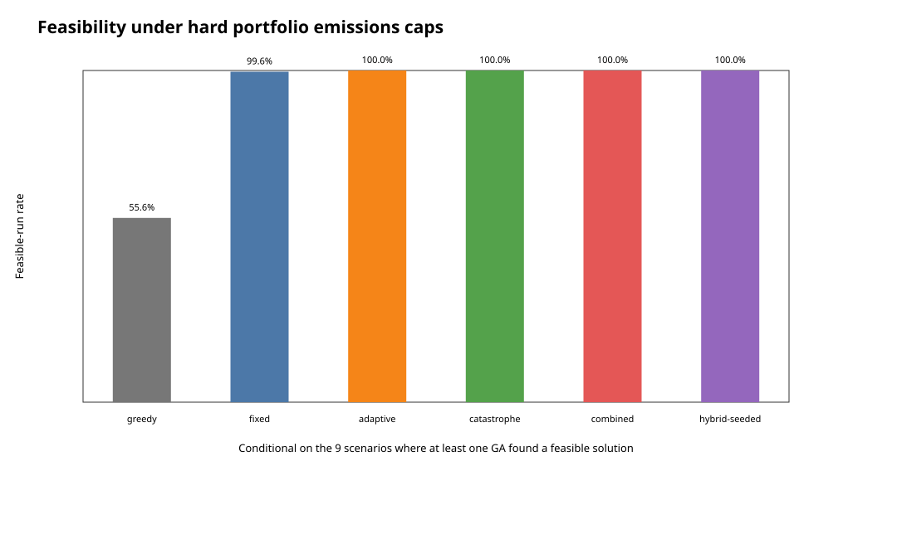
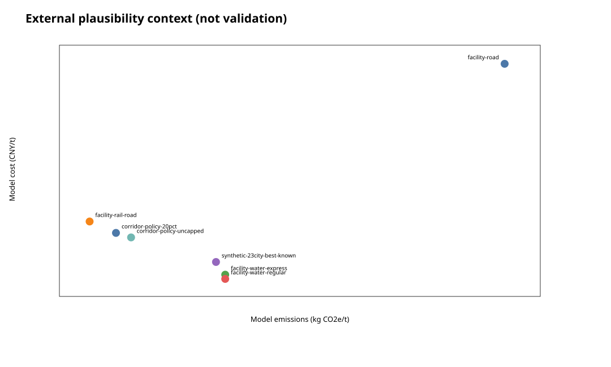

# Carbon-aware multimodal freight routing

## Integrated problem, data, algorithm and result report

Report date: 28 September 2026

## 1. Executive summary

This project studies how freight orders can be routed from Chongqing toward Shanghai using road, rail and inland-water services while balancing operating cost, delivery deadlines, shared service capacity and carbon emissions.

The work has two evidence-separated layers:

1. **2022 competition implementation.** Personally authored project code built a 23-city, three-mode graph, used a 69-integer priority chromosome, decoded routes, calculated transport, transfer, time-window and carbon costs, and integrated the problem with Geatpy. Team members jointly collected case data. Geatpy is a third-party framework and the broader information-sharing platform was team work.
2. **Maintained engineering system.** The later system preserves the historical snapshot and adds validated inputs, facility-level provenance, cycle-safe route generation, shared-capacity global order allocation, hard emissions targets, five GA ablations, exact micro-oracles, controlled synthetic tests and reproducible reports.

The strongest current result is not a claim of enterprise data scale or deployment savings. It is an auditable demonstration that a globally coupled allocation model can trade cost against carbon under explicit assumptions. In the central corridor-calibrated policy scenario, a 20% hard target led to a best formal allocation with 21.0% lower emissions and 7.7% higher total model cost than the frozen uncapped reference; the broader three-seed screening solution achieved 22.34% reduction with a 9.63% non-carbon operating-cost premium. The discrepancy reflects heuristic search and indivisible orders, not hidden data changes.

## 2. Problem definition

### 2.1 Decision context

A shipper has a portfolio of freight orders. Each order has an origin, destination, payload, release time and deadline. Road, rail and water differ in price, transit time and emissions. Scheduled or planning-horizon services have finite capacity. Selecting a cheap service for one order can remove it from another order's feasible set, so independent shortest paths do not solve the portfolio problem.

### 2.2 Decision variables

Graph preprocessing generates a bounded candidate set `K_i` for each order `i`. One integer gene selects candidate `x_i`:

```text
x_i in {0, ..., |K_i|-1}
```

A candidate records route nodes, edge IDs, mode sequence, arrival time, capacity claims, operating-cost components, emissions and transport work.

### 2.3 Objective

The maintained allocation objective is:

```text
min C(x) = sum_i [transport_i + transfer_i + waiting_i + lateness_i]
           + CarbonCost(sum_i emissions_i)
```

The progressive carbon schedule is applied once to portfolio emissions instead of restarting the first bracket for every order.

### 2.4 Hard constraints

```text
arrival_i <= deadline_i
sum_i tonnes_i * use(i, resource) <= tonnes_capacity_resource
sum_i units_i  * use(i, resource) <= units_capacity_resource
sum_i emissions_i <= emissions_cap      [when enabled]
```

The evaluator returns a normalized violation for every hard constraint. Solvers rank solutions by total violation first, cost second and emissions third. A lower-cost violating allocation never outranks a feasible allocation.

### 2.5 What the model does not claim

- It does not price or dispatch a live carrier service.
- It does not prove a global optimum for full portfolios.
- It does not infer a transfer terminal merely because a route passes a city.
- It does not convert public throughput totals into shipment records.
- It does not treat modelled orders, assumed capacity or synthetic edges as enterprise data.

## 3. Requirements analysis

### 3.1 Functional requirements

| Requirement | Implemented response |
| --- | --- |
| Represent multiple modes | Explicit directed road, rail and water edges |
| Represent real transfers | Facility-specific transfer records; no automatic transfer at every city |
| Evaluate route economics | Transport, transfer, waiting, lateness and carbon cost components |
| Respect service feasibility | Hard deadlines, availability and shared tonnes/unit capacity |
| Support carbon policy | Soft carbon price and optional hard aggregate emissions cap |
| Handle many orders jointly | One candidate-choice gene per order and portfolio-level evaluation |
| Compare algorithms fairly | Fixed budgets, paired seeds and shared constraint initialization |
| Reproduce small results exactly | Exact enumeration for explicitly bounded micro-instances |
| Explain results | CSV/JSON details, method summaries and generated SVG figures |

### 3.2 Non-functional requirements

- **Auditability:** every public value has a URL/source ID; every model assumption is labelled.
- **Reproducibility:** deterministic generators, fixed seeds and commands are checked in.
- **Safety:** original SODA evidence remains read-only; the repository stores only redistributable snapshots and derived data.
- **Portability:** the main allocation implementation uses the Python standard library; Geatpy is isolated in a pinned container.
- **Testability:** exact micro-oracles, unit tests and repository-link/hash verification catch semantic and packaging regressions.
- **Honest interpretation:** heuristic best-known, synthetic, calibrated, historical and observed values are never collapsed into one evidence category.

## 4. Data collection and organization

### 4.1 Historical competition data

The 2022 case used 23 corridor/Delta city names and road, rail and water distances assembled for the Chongqing--Shanghai example. The team jointly collected case inputs because Shanghai open data did not provide a complete interprovincial multimodal operational dataset. Relevant SODA material was limited mainly to Shanghai road-route detail and aggregate freight totals. The model input was not a database of hundreds of thousands of enterprise orders.

The recovered code reads:

- one city-pair distance workbook;
- mode speed, rate and emissions parameters;
- transfer time, cost and emissions parameters;
- storage and lateness penalties;
- carbon brackets;
- one time window;
- demand-scenario quantities and probabilities, although the recovered objective uses a fixed 100 t instead.

### 4.2 Facility evidence registry

The maintained registry contains:

- 20 candidate facilities, 15 exactly resolved;
- 12 service-evidence records;
- five transfer-capability records;
- seven calibrated numeric edges;
- one facility-specific transfer;
- three runnable reference cases.

Raw evidence remains separate from numerical model inputs. No public service record currently supplies complete comparable endpoints, distance, tariff, timing, capacity and handling fields, so the optimizer does not silently treat any raw record as a complete observed edge.

### 4.3 Key corridor anchors

The calibrated Chongqing--Yangshan case uses the following scoped references:

| Input | Value | Evidence boundary |
| --- | ---: | --- |
| Road / rail / water comparison | CNY 15,000 / 4,600 / 1,400 per 20-ft | Public corridor comparison; inclusions incomplete |
| Express water time | 8--9 days | Published range; booking wait unknown |
| Regular water | 10 days, CNY 1,130 FIO | Current operator time and official index, not one invoice |
| Historical rail time | 55--60 h | Historical same-corridor operation, not a current timetable |
| Road / rail / water factors | 0.076 / 0.003 / 0.020 kgCO2e/(t-km) | Official default factors, not equipment measurements |
| Rail distance | 1,733 km | Team-collected workbook row |
| Luchaogang--Yangshan | about 45 km, one CNY 200 posting | Not a contract average |

### 4.4 Three data classes used in experiments

1. **Facility-calibrated values:** public/operator/team inputs with field-level provenance and remaining assumptions.
2. **Synthetic calibrated graph:** city names and aggregate distributions anchor generation, but edges, orders and capacity are synthetic.
3. **Deterministic model orders:** reproducible payload, release and deadline scenarios for policy analysis; not observed transactions.

## 5. Algorithm construction

### 5.1 Historical algorithm

The original graph has 69 mode-layer nodes. A 69-integer chromosome assigns priorities to expanded nodes. Starting in Chongqing, the decoder looks at outgoing nodes in all three mode layers and chooses the reachable node with the highest priority. The fitness is the sum of four cost components.

This is a valid project-specific encoding and fitness design, while Geatpy supplies selection, crossover, mutation and the SEGA evolution loop. The recovered decoder has no backtracking or visited-node protection. Loaded demand scenarios do not enter the recovered fitness. See [the full historical analysis](original-ga-code-analysis.md).

### 5.2 Maintained route candidate generation

Small graphs enumerate city-simple routes. Larger graphs use bounded beam search with road-only, rail-only, water-only and unrestricted groups. Schedule labels add departure waiting and capacity claims. Retention protects cost, speed, emissions, capacity fallback and mode diversity.

This stage is preprocessing. A bounded beam is not an exhaustive path proof.

### 5.3 Global allocation GA

Every GA uses:

- one integer gene per order;
- capacity-aware random initialization;
- a shared low-emission feasible seed when a hard cap is active;
- ternary tournament selection;
- contiguous-segment crossover;
- candidate-aware integer mutation;
- parent--offspring merge with elite retention.

The adaptive controller measures locus diversity and stagnation. The selected hybrid uses an expected 1.0--2.5 mutated genes per child under a 2.5 cap; the selected non-seeded combined control uses a 1.25 base and 3.0 cap. Crossover ranges from 0.72 to 0.85. Catastrophe-enabled methods target a 25% partial restart after 30 stagnant generations. The hybrid additionally maintains an opportunity-loss greedy incumbent.

### 5.4 Baselines and exact checks

- earliest-deadline greedy allocation;
- opportunity-loss greedy allocation;
- exact Cartesian enumeration when the named candidate product is small;
- fixed GA as the operator baseline;
- adaptive-only and catastrophe-only ablations;
- combined and hybrid-seeded variants.

An exact result is valid only for the explicitly named candidate set. The 48-order and policy portfolios are heuristic.

## 6. Experiment design

### 6.1 Experiment A: evaluator and constraint verification

Twelve model orders share eight timed departures on the three-node/five-edge facility graph. A four-order prefix contains 3,072 candidate combinations and is exhaustively enumerated. This experiment validates arithmetic and constraints; it is intentionally not evidence that a GA is needed.

### 6.2 Experiment B: 23-city multi-OD algorithm stress test

- 23 cities, 145 synthetic directed mode edges;
- 48 synthetic orders, 2,055 t, 23 OD pairs;
- 96 synthetic shared planning resources;
- five GA methods, 30 seeds each;
- 100 individuals x 150 generations per run.

This experiment asks whether population search improves a coupled synthetic allocation. It does not assess current carrier operations.

### 6.3 Experiment C: 23-city objective and transport-policy matrix

The same 48 orders, graph, candidate budget and GA budget are held fixed while the policy changes:

- road-only cost minimization;
- single-mode-per-order cost minimization, where different orders may use different modes but no order changes mode;
- multimodal-enabled cost minimization, retaining both direct and transfer candidates;
- multimodal-enabled hard reductions of 20%, 40%, 55% and 60%;
- a single-mode-per-order 55% boundary case.

Every reduction is measured against the best-known road-only cost solution for the same portfolio. Every scenario compares the same five GA variants over 30 seeds. Greedy is an auxiliary reference, not one of the five formal methods.

### 6.4 Experiment D: corridor policy and external plausibility

The policy grid uses one facility-calibrated corridor and deterministic model orders:

- demand: 24, 48 or 72 orders;
- deadline profiles: tight, balanced or relaxed;
- carbon shadow price: 0, 97.49 or 6,000 CNY/tCO2e;
- hard reduction target: 0%, 9.5%, 20% or 30%;
- 108 screening cells;
- twelve formal boundary scenarios;
- five GA methods x 30 seeds = 1,800 formal GA runs.

The 9.5% target is inspired by China's 2030 transport-intensity target. The 20% and 30% cases use IMO 2030 percentages as stress levels. They are not represented as direct legal caps on this domestic corridor.

## 7. Results and analysis

### 7.1 Facility route economics

For a central 15-t shipment:

| Alternative | Cost per tonne | Emissions per tonne | Time |
| --- | ---: | ---: | ---: |
| Road | CNY 1,000.00 | 128.82 kg | 96.00 h |
| Rail-road | CNY 322.00 | 8.747 kg | 64.75 h |
| Express water | CNY 93.33 | 47.98 kg | 204.00 h |
| Regular water | CNY 75.33 | 47.98 kg | 240.00 h |

The current factors make rail-road the lowest-emission option and water the lowest-cost option when deadlines allow. Carbon prices around CNY 97/tCO2e are too small to bridge the tariff difference; a hard cap changes the allocation more directly.

### 7.2 Synthetic algorithm result

The 23-city deadline-greedy baseline costs CNY 398,224.22. The best formal hybrid seed/run costs CNY 324,492.36, 18.52% below greedy. Hybrid has the lowest mean cost and standard deviation across 30 seeds; adaptive and combined share a slightly lower median. Method distributions overlap, so it is not correct to claim hybrid wins every seed.

The controller was selected on seeds 30--39, validated on seeds 40--69, and finally reported on seeds 0--29. The selected hybrid beats the legacy hybrid in 23/30 held-out pairs, with a mean paired change of -CNY 4,257.77 and an approximate 95% interval of [-6,305.60, -2,209.93]. This prevents direct parameter selection on the formal seed set and supports only this fixed synthetic instance.

### 7.3 Objective and transport-policy matrix

The road-only reference costs CNY 618,893.09, emits 217,720.96 kg and has an 18.65-h tonne-weighted transit time. The best-known no-transfer portfolio costs CNY 332,353.03 and emits 104,025.60 kg. The dominance-consistent multimodal archive costs CNY 322,104.18 and emits 99,543.59 kg: 47.95% lower cost and 54.28% lower emissions than the synthetic road-only reference, with a longer 43.23-h weighted transit time.

Relative to no-transfer routing, the multimodal archive is 3.08% cheaper and 4.31% lower-emitting, with 2.83% longer weighted transit. It assigns 160 t to routes that change mode, alongside 160 t road-only, 910 t rail-only and 825 t water-only. This is a model allocation; route-category tonnes do not measure observed carrier traffic.

The 20% and 40% caps are non-binding because cost-minimizing rail/water choices already exceed those reductions relative to road. All five GA methods are 30/30 feasible in those scenarios. No method finds a feasible result at 55% or 60%, or in the no-transfer 55% case, under the tested candidate and search budgets. That is a search/candidate boundary, not mathematical proof of infeasibility.


### 7.4 Central corridor policy frontier

The frozen central balanced reference contains 48 orders and 720 t. Screening results are:

| Target | Achieved reduction | Total model cost | Non-carbon premium | Average abatement cost |
| ---: | ---: | ---: | ---: | ---: |
| 0% | 0% | CNY 182,555 | 0% | n/a |
| 9.5% | 10.51% | CNY 189,282 | 3.80% | CNY 4,384/tCO2e |
| 20% | 22.34% | CNY 199,670 | 9.63% | CNY 5,230/tCO2e |
| 30% | 30.22% | CNY 203,826 | 11.99% | CNY 4,812/tCO2e |

The curve is not guaranteed to be monotone in estimated average abatement cost because orders are indivisible and every point is heuristic best-known output.

The best formal 20% result costs CNY 196,549.45 and emits 11,790.46 kg versus the frozen 14,929.10 kg reference. Rail-road rises from 500 to 580 t; water falls from 220 to 140 t.


### 7.5 Corridor feasibility and algorithm interpretation

Nine of twelve selected formal scenarios have a known feasible GA result. Conditional on those nine scenarios:

- adaptive, catastrophe, combined and hybrid: 270/270 feasible runs;
- fixed: 269/270;
- greedy: 5/9 deterministic scenarios.

No method found a feasible solution for high-demand 20%, tight-deadline 20%, or high-carbon-price-baseline plus another 20% reduction. This is a capacity/search boundary, not a mathematical infeasibility certificate.

In the central policy case, all advanced methods often reach the same best cost. Experiment D therefore demonstrates constraint handling and mode trade-offs more than GA superiority. Experiment B remains the relevant algorithm-search comparison.



### 7.6 External plausibility, not validation

The formal synthetic 23-city best-known allocation averages CNY 157.90/t and 48.67 kg/t. Those values lie inside the wide route-level corridor ranges, but the synthetic portfolio mixes many shorter OD pairs. This comparison checks order of magnitude and direction only; it does not validate the 23-city cost as a Chongqing--Shanghai quote.



## 8. Conclusions

### 8.1 Technical conclusion

The project now cleanly separates three questions:

- Is the historical routing concept real? Yes: recovered code confirms a project-specific graph, priority decoder and four-part objective integrated with Geatpy.
- Does the maintained GA have a meaningful task? Yes: multi-order allocation introduces shared capacity and aggregate carbon coupling that repeated shortest paths cannot resolve independently.
- Are the results real operational savings? No: the strongest current experiments use calibrated public inputs plus modelled or synthetic orders and capacity.

### 8.2 Corrected claims

Avoid claims that the competition processed a large enterprise order table, that Shanghai open data supplied the entire 23-city multimodal network, that robust scenarios entered the recovered objective, or that the solver proves global optimality. The archived 64% cost and 65% carbon statement is a historical simulation claim whose denominator and reproducible calculation have not been recovered; it should not be presented as measured deployment benefit.

### 8.3 Defensible interview narrative

> I designed and implemented the routing and quantitative-analysis workflow for a university multimodal freight project. The original Python/Geatpy model represented 23 corridor cities across road, rail and water layers, encoded route priorities, and evaluated transport, transfer, time-window and carbon costs. Because suitable interprovincial operating data were limited, our team assembled one Chongqing--Shanghai case rather than using an enterprise order database. I later made the system reproducible and extended it from single-route search to global order allocation with shared capacity and hard emissions targets. In controlled synthetic and corridor-calibrated experiments, I compared greedy, fixed, adaptive, catastrophe and hybrid GA variants across multiple seeds and reported both cost/carbon trade-offs and the limits of the evidence.

This narrative preserves ownership and technical depth without implying that third-party Geatpy code, team platform modules, synthetic orders or later extensions were all part of the same historical artifact.

## 9. Reproduction

```bash
python3 -B -m unittest discover -s tests -p 'test_*.py'
python3 -B tools/run_facility_case_analysis.py
python3 -B tools/run_synthetic_allocation_experiment.py
python3 -B tools/run_synthetic_objective_matrix.py
python3 -B tools/run_policy_allocation_experiment.py
sh tools/run_geatpy_tests.sh
python3 -B tools/audit_results.py
python3 -B tools/verify_repository.py
```

The original SODA evidence directory is never required as a writable runtime location.
