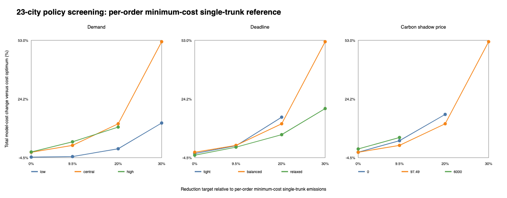
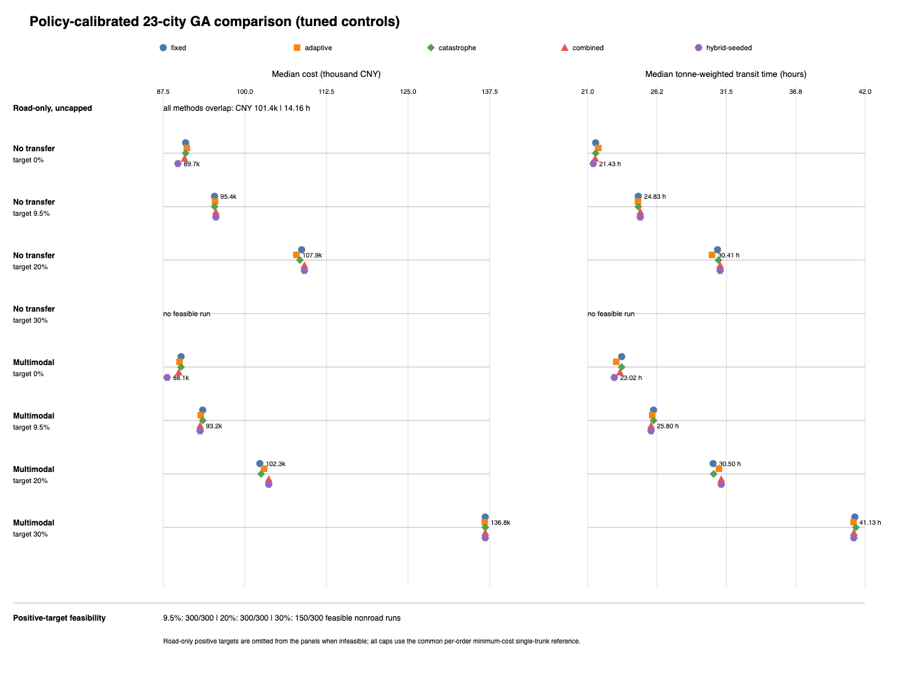

# Carbon-Aware Multimodal Freight Routing

## Interview technical report

Report date: 29 September 2026

## Executive summary

This project solves a portfolio freight-allocation problem: for every order, choose a road, rail, water or multimodal route while satisfying its delivery deadline, shared service capacity and an optional portfolio carbon cap. The objective minimizes operating cost plus a portfolio-level carbon charge.

The work began with a 23-city single-route genetic algorithm and was extended into an order-allocation system. The current pipeline generates route-and-departure candidates, calculates operational time from actual connection readiness, assigns one candidate to each order, and optimizes all orders jointly because they compete for the same departures.

The central policy experiment contains 48 orders, 730 tonnes, 23 cities and 328 directed mode edges. It compares road-only, single-mode and multimodal candidate sets under 0%, 9.5%, 20% and 30% emissions-reduction targets. Five GA variants are evaluated over 30 seeds with identical population and generation budgets.

The main result is a quantified cost--carbon--time curve. In the multimodal scope, the best median method costs CNY 88,091 with no cap and CNY 136,752 at the 30% target; tonne-weighted transit time rises from 23.02 to 41.13 hours. Water departures become progressively more important and capacity-constrained. The experiment also shows that no GA variant dominates every target: heuristic seeding is strongest without a tight cap, fixed control wins at 20%, and adaptive control has the lowest median at 30%.

## 1. Decision problem

The operational decision is made for a portfolio rather than for one shipment. Each order has:

- an origin and destination;
- a release time and delivery deadline;
- a payload and shipment-unit count;
- a bounded set of route-and-departure candidates.

Let `x_i` select one candidate for order `i`. The portfolio objective is:

```text
min  sum_i operating_cost(i, x_i)
     + CarbonCost(sum_i emissions(i, x_i))
```

The main constraints are:

```text
arrival(i, x_i) <= deadline(i)

sum_i tonnes(i) * use(i, x_i, departure) <= departure tonne capacity

sum_i units(i) * use(i, x_i, departure) <= departure unit capacity

sum_i emissions(i, x_i) <= portfolio emissions cap
```

The resulting problem combines multiple-choice assignment, shared multidimensional capacity and a portfolio emissions constraint. A route that is cheapest for one order can be globally poor when it consumes a scarce departure needed by another order.

Solutions are ranked lexicographically by:

1. total normalized constraint violation;
2. total cost;
3. total emissions.

This feasibility-first ordering is used consistently by greedy allocation, exact enumeration and every GA variant.

## 2. From network data to allocation candidates

The optimization pipeline has four stages.

```text
23-city mode graph
        ↓
bounded route generation
        ↓
route + departure timing labels
        ↓
portfolio allocation by greedy, exact or GA search
```

### 2.1 Network representation

Every edge contains a mode, distance, speed, transport rate and emissions factor. Mode changes are allowed only when a transfer record exists. A transfer adds cost, emissions and time.

Small networks enumerate city-simple routes. The 23-city network uses mode-diverse beam search. For each order, the candidate-retention stage protects:

- the lowest-cost candidate;
- the fastest candidate;
- the lowest-emissions candidate;
- a capacity-independent candidate;
- representatives of different mode sequences.

The policy experiment searches at most 80 physical routes per order and retains six route-and-departure candidates for allocation.

### 2.2 Operational time model

Arrival time is calculated as:

```text
arrival = release
        + scheduled waiting
        + travel
        + loading and unloading
        + terminal or port dwell
        + lock delay
        + reliability buffer
        + mode-transfer time
```

Water services depart every 24 hours. Each lane receives a deterministic six-hour phase offset, so an order uses the first departure after it is ready. Missing a connection therefore adds a full headway instead of an average waiting penalty.

| Mode | Dispatch model | Handling per leg | Dwell per leg | Lock delay | Reliability buffer |
| --- | --- | ---: | ---: | ---: | ---: |
| Road | 1-hour dispatch wait | 2 h | 0 h | 0 | 2 h |
| Rail | 6-hour dispatch wait | 6 h | 2 h | 0 | 6 h |
| Water | 24-hour fixed service | 8 h | 6 h | 4 h/1,000 km | 8 h |

Fixed transfer time is 6 hours for road--rail, 10 hours for road--water and 12 hours for rail--water. The volume-dependent transfer term is added to these fixed values.

Water capacity is 20 tonnes and two shipment units per departure. A 20-tonne order fills a sailing by itself; two 10-tonne orders also fill it. This creates direct competition among otherwise attractive low-emissions candidates.

### 2.3 OD- and cargo-specific deadlines

Orders use 48-, 60- or 72-hour lead times. The assigned class depends on OD span and cargo type:

| Cargo class | Short OD | Medium OD | Long OD |
| --- | ---: | ---: | ---: |
| Time-sensitive | 48 h | 48 h | 60 h |
| General container | 48 h | 60 h | 72 h |
| Bulk non-perishable | 60 h | 72 h | 72 h |

The tight and relaxed profiles shift this base assignment by one service-class step. For the formal central/balanced portfolio, the result is 25 orders at 48 hours, 16 at 60 hours and seven at 72 hours.

## 3. Carbon target and comparison baseline

The emissions target is measured from a traditional single-trunk reference. Each order independently chooses its minimum-cost deadline-feasible pure-road, pure-rail or pure-water candidate:

```text
reference emissions
  = sum_i emissions(
        argmin cost among feasible pure-road, pure-rail and pure-water candidates
    )

emissions cap(target)
  = reference emissions * (1 - target)
```

The central/balanced reference selects 39 road orders and nine water orders. Its cost is CNY 89,738.77 and its emissions are 20,059.06 kg CO2e. The three positive caps are therefore:

| Target | Emissions cap |
| ---: | ---: |
| 9.5% | 18,153.45 kg |
| 20% | 16,047.25 kg |
| 30% | 14,041.34 kg |

This denominator makes the target answer a precise question: how much must emissions fall relative to the cheapest feasible traditional trunk-mode choice for the same orders?

## 4. Optimization algorithms

The chromosome contains one integer gene per order. A gene indexes one retained route-and-departure candidate. Every GA uses:

- capacity-aware randomized initialization;
- ternary tournament selection;
- contiguous-segment crossover;
- candidate-aware integer mutation;
- parent--offspring merging and elite retention;
- the same low-emissions feasibility seed when a hard cap is active.

Five variants isolate the effect of search controls:

| Variant | Adaptive mutation | Partial restart | Deterministic archive seed |
| --- | --- | --- | --- |
| Fixed | No | No | No |
| Adaptive | Yes | No | No |
| Catastrophe | No | Yes | No |
| Combined | Yes | Yes | No |
| Hybrid-seeded | Yes | Yes | Yes |

Adaptive control responds to population diversity and generations without improvement. Catastrophe preserves unique elites and replaces 10% of the population after 12 stagnant generations. Hybrid-seeded additionally injects an opportunity-loss greedy incumbent stored in an external archive.

Hyperparameters are selected on seeds 100--107, checked on seeds 110--129 and then frozen for formal seeds 0--29. The selected settings are:

- adaptive: expected mutation range 0.75--1.25, patience 30;
- catastrophe: patience 12, restart fraction 10%;
- combined and hybrid: expected mutation range 0.5--1.0, patience 12, restart fraction 10%.

## 5. Experimental chain

The evaluation follows one sequence from correctness to scale.

### 5.1 Arithmetic and constraint check

A three-node/five-edge facility graph verifies transport cost, carbon cost, time composition, scheduled departures and shared capacity. A four-order subset contains 3,072 assignments and is solved exhaustively. This establishes that the candidate evaluator and capacity accounting agree with exact enumeration.

### 5.2 Policy sensitivity screen

The screen crosses:

- low, central and high demand;
- tight, balanced and relaxed deadlines;
- carbon shadow prices of CNY 0, 97.49 and 6,000 per tCO2e;
- 0%, 9.5%, 20% and 30% reduction targets.

This produces 108 policy cells. Eighty cells obtain feasible allocations under the screening budget. Demand, deadline and carbon-price changes alter both the cost premium and the reachable mode mix.



### 5.3 Formal five-GA comparison

The formal matrix crosses three route scopes, four targets, five methods and 30 seeds, producing 1,800 method--seed records. Every run uses population 40 and 60 generations.

| Candidate scope | 0% | 9.5% | 20% | 30% |
| --- | ---: | ---: | ---: | ---: |
| Road-only | 150/150 | 0/150 | 0/150 | 0/150 |
| Single mode per order | 150/150 | 150/150 | 150/150 | 0/150 |
| Multimodal enabled | 150/150 | 150/150 | 150/150 | 150/150 |

Only multimodal-enabled runs reach the 30% target. The single-mode search reaches 20% but not 30%, while road-only records 0/150 feasible runs at every positive target.

### 5.4 Exact reduced-instance benchmark

A separate six-order benchmark retains four candidates per order, giving 4,096 assignments per target. Exhaustive enumeration supplies the true candidate-set optimum. This measures the optimality gap of the deterministic archive and the GA variants and tests whether hybrid seeding makes the search trivial.

## 6. Results

### 6.1 Cost--carbon--time trade-off

The following table reports the lowest formal median cost among the five methods in the multimodal scope.

| Target | Best-median method | Median cost | Median emissions | Median transit time |
| ---: | --- | ---: | ---: | ---: |
| 0% | Hybrid-seeded | CNY 88,091.21 | 19,624.66 kg | 23.02 h |
| 9.5% | Combined / Hybrid-seeded | CNY 93,152.34 | 18,050.12 kg | 25.80 h |
| 20% | Fixed | CNY 102,300.23 | 16,005.62 kg | 30.50 h |
| 30% | Adaptive | CNY 136,751.84 | 14,030.21 kg | 41.13 h |

The cost curve steepens sharply between 20% and 30%. Relative to the uncapped best median, the 30% target increases cost by about 55% and transit time by about 79%. The optimizer uses more scheduled water capacity to reach the lower-emissions region, which introduces additional waiting and operational delay.

### 6.2 Capacity pressure

In the central screening incumbents, water use evolves as follows:

| Target | Water departures used | Full departures | Maximum utilization |
| ---: | ---: | ---: | ---: |
| 0% | 12 | 6 | 100% |
| 9.5% | 13 | 7 | 100% |
| 20% | 15 | 7 | 100% |
| 30% | 23 | 8 | 100% |

The 30% solution cannot be obtained by independently switching the cheapest orders to water. The algorithm must coordinate departure choice, capacity and connecting-route timing across the portfolio.

### 6.3 What the five variants reveal

No variant wins every target.

- Hybrid-seeded is strongest without a tight cap because its deterministic archive already contains a high-quality cost allocation.
- Combined and hybrid tie at 9.5%.
- Fixed has the lowest median at 20%, so extra control logic does not automatically improve the result.
- Adaptive has the lowest median at 30%, where diversity control becomes more useful.
- Catastrophe matches fixed at low targets. Restarts become frequent at 30%, but do not produce the lowest median cost.

This explains the earlier weak catastrophe result: at loose targets, the search rarely stagnates long enough for restart to matter; at the tightest target, restart occurs but spends evaluations rebuilding feasible combinations.



### 6.4 Hybrid seeding and NP-hardness

Hybrid seeding improves the starting point; it does not solve the full problem exactly. The allocation remains combinatorial because 48 orders each choose among multiple candidates while sharing departure capacity and an aggregate carbon cap.

The six-order exact benchmark makes the distinction measurable:

- deterministic archive gaps are 11.97%, 0.91% and 3.57% at the 9.5%, 20% and 30% targets;
- GA variants reach the exact optimum in at least one run;
- median GA gaps are zero except combined at 9.5% (0.095%) and 30% (0.073%).

The archive is therefore a strong heuristic seed, but it is not guaranteed to be optimal. GA evolution supplies measurable improvement on the reduced instance.


## 7. Technical conclusions

The project produces four main engineering conclusions.

1. **Operational time changes the mode mix.** Fixed sailings, port operations, lock delay and reliability buffers prevent water from dominating solely because of its low tariff and emissions factor.
2. **Carbon targets create a nonlinear cost curve.** The 9.5% and 20% targets can be met with moderate reallocation; 30% requires substantially more water capacity and longer transit time.
3. **Multimodal flexibility matters most under the tightest constraint.** Single-mode candidates reach 20%; in the formal results, only multimodal-enabled runs reach 30%.
4. **Algorithm mechanisms are instance-dependent.** Seeding is valuable for the uncapped cost problem, adaptation helps at the tightest cap, and catastrophe alone adds little under the current 60-generation budget.

My contribution centered on the quantitative workflow: graph and candidate representation, objective and constraint construction, integration of genetic search, capacity-aware allocation, exact reduced-instance checks, experimental design, result analysis and visualization.

## 8. Interview narrative

### 90-second explanation

> I modelled multimodal freight planning as a portfolio allocation problem rather than a single shortest-path problem. Each gene chooses one route-and-departure candidate for an order, and all genes are coupled by departure capacity and a portfolio carbon cap. I first generate mode-diverse candidates, then calculate arrival time from the actual release time, fixed service schedule, travel, terminal operations, lock delay, reliability buffer and transfer time. I compare five GA variants under the same budget and validate the solver with exact enumeration on reduced cases. In the central 48-order experiment, the best median cost rises from about CNY 88,000 without a cap to CNY 137,000 at a 30% reduction target, while transit time rises from 23 to 41 hours. The key insight is that aggressive carbon reduction is not just a cleaner-mode choice; it is a capacity-and-scheduling problem, and multimodal flexibility becomes important under the tightest constraint.

### Likely technical follow-ups

**Why use a GA instead of Dijkstra?**

Dijkstra can optimize one additive path. Here, many orders choose jointly among route-and-departure candidates, consume shared multidimensional capacity and must satisfy an aggregate carbon cap. The coupling removes the independent shortest-path structure.

**Why is the problem NP-hard?**

After candidate generation, it contains a multiple-choice multidimensional knapsack/generalized-assignment structure: choose exactly one candidate per order while respecting shared resource capacities and emissions.

**Why did hybrid not win every scenario?**

Its archive is designed around opportunity cost and gives an excellent uncapped starting point. Under a tight emissions cap, that starting structure can be less useful than maintaining broader population diversity, so fixed or adaptive search can achieve a lower median.

**Why did catastrophe add little?**

At loose targets it usually did not trigger. At 30%, it triggered often, but reconstructing capacity-feasible portfolios consumed much of the remaining budget. Increasing generations could change that trade-off, but under the fixed 60-generation budget adaptation was more effective.

**How was correctness checked?**

Cost, time and capacity components have unit tests; a small facility allocation is exhaustively enumerated; and a six-order/four-candidate benchmark reports exact optimality gaps.

## 9. Reproduction

```bash
python3 -B -m unittest discover -s tests
python3 -B tools/tune_synthetic_policy_ga.py
python3 -B tools/run_synthetic_policy_matrix.py
python3 -B tools/run_algorithm_discrimination_benchmark.py
python3 -B tools/verify_repository.py
```

Main outputs:

- [`synthetic-23city-policy-matrix`](../benchmarks/synthetic-23city-policy-matrix/)
- [`synthetic-23city-policy-tuning`](../benchmarks/synthetic-23city-policy-tuning/)
- [`algorithm-discrimination`](../benchmarks/algorithm-discrimination/)
- [`policy experiment configuration`](../data/policy_experiment.json)
