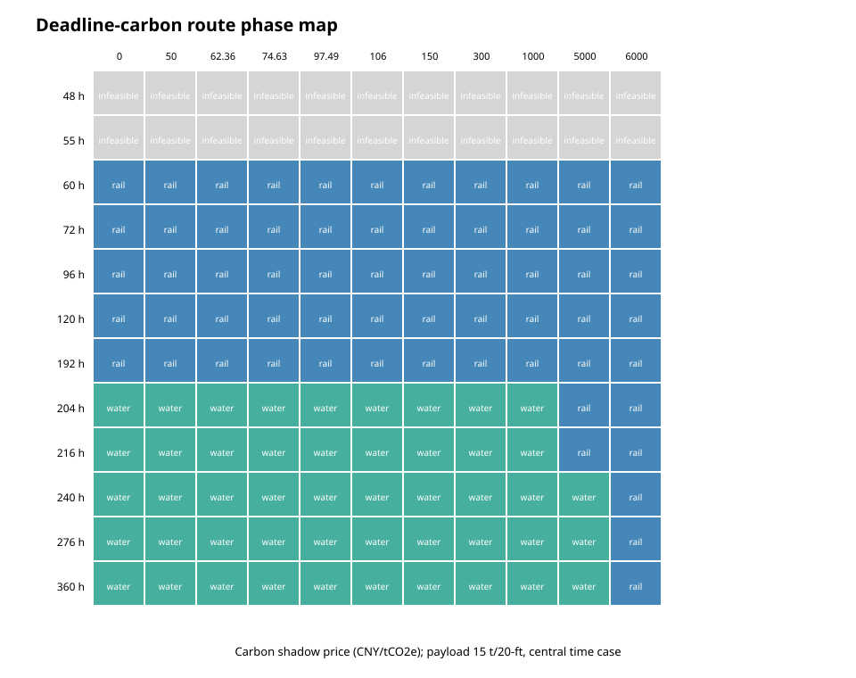
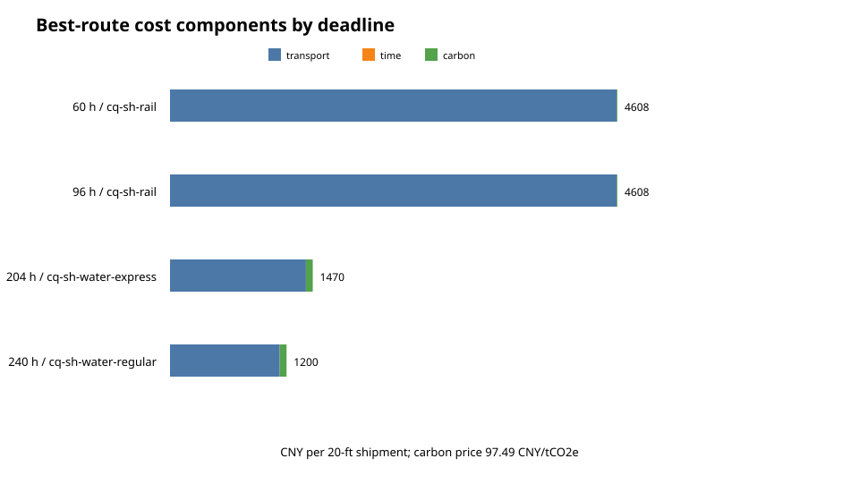
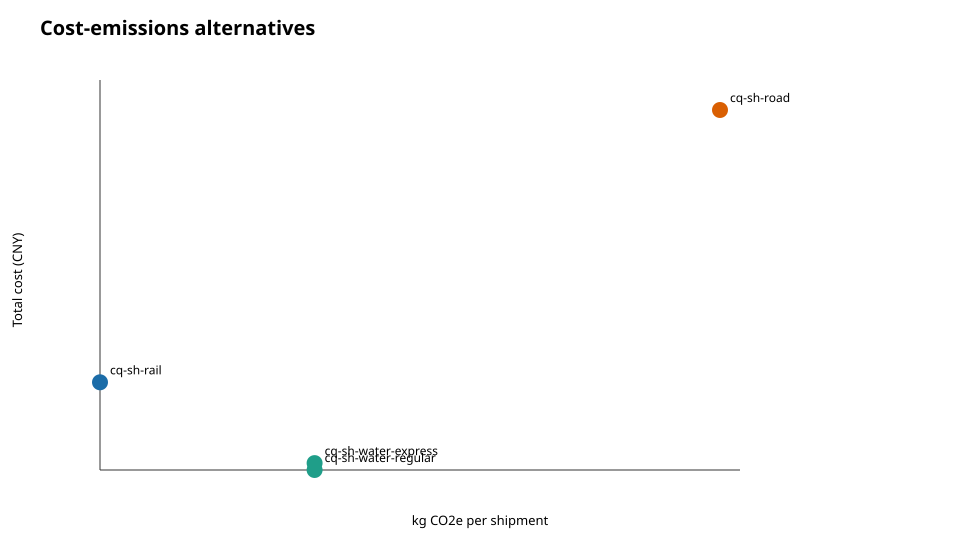
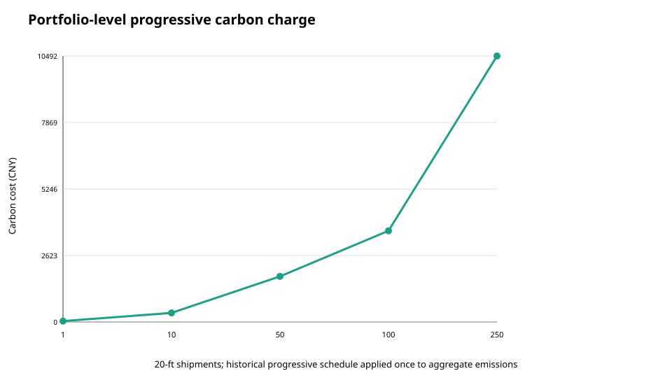
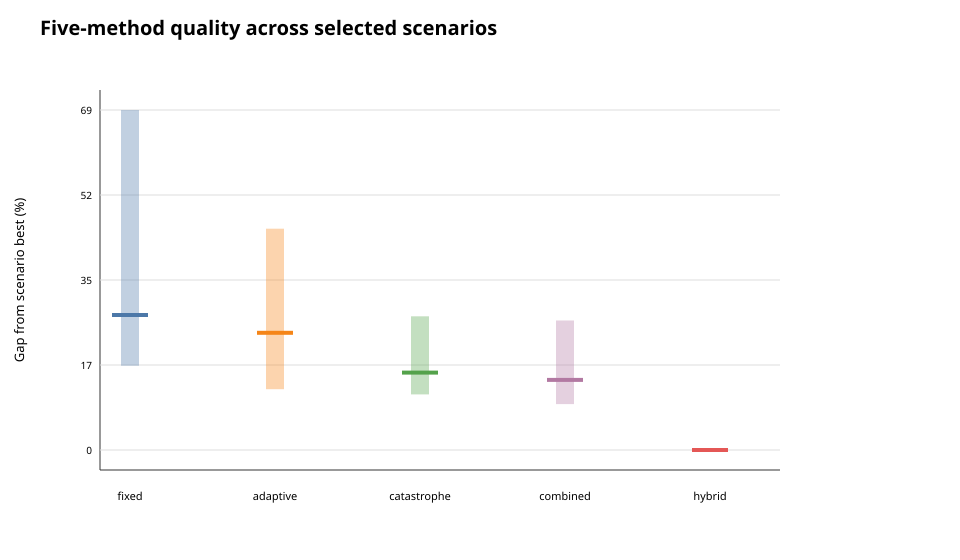

# 运营数据校准走廊实验结果

## 1. 确定性路线切换

完整网格包含1,188个组合。在15吨/20英尺箱、中央时效、97.49元/tCO2e下：

| 硬截止时间 | 最低成本可行服务 | 到达时间 | 总成本 |
| ---: | --- | ---: | ---: |
| 48/55 h | 不可行 | — | — |
| 60–192 h | 铁路 | 57.5 h | 4,607.60元 |
| 204/216 h | 快水运 | 204 h | 1,470.16元 |
| 240/276/360 h | 普通水运 | 240 h | 1,200.16元 |

公路中央档96小时后可行，但其15,000元报价和1,932.30 kg模型排放均高于铁路，因此没有成为最低成本路线。这不是“公路不存在”，而是当前目标函数和可用服务假设下被支配。

15吨下，铁路相对快水运和普通水运的碳价平衡点分别约为4,986.64和5,407.38元/tCO2e。97.49元参考影子价不足以改变选择；5,000/6,000元只是结构压力测试，不是预测碳税。

## 2. 成本—排放权衡

按当前默认因子和15吨假设：铁路77.985 kgCO2e/箱，水运719.70 kg，公路1,932.30 kg。铁路最低排放但报价高于水运；快水运与普通水运使用同一距离和方式因子，因此模型排放相同，区别来自价格和时效。

这些是缺省因子计算值，不是车辆、列车或船舶实测排放。2022模型使用另一组因子，不能与当前校准层混为同一数据版本。

## 3. 累计分段碳价

250票15吨水运箱累计179,925 kg，历史阶梯的正确累计碳成本为10,492.50元；若错误地每票重置第一档则为8,996.25元，低估1,496.25元（14.26%）。48和55小时无可行服务，在组合表中明确记录为 `infeasible`，不制造空结果。

## 4. 五种搜索方法

15场景 × 5方法 × 30种子得到2,250次运行，每次400个GA候选评价：

| 方法 | 可行运行率 | 相对场景最佳值的中位差距 | 四分位区间 | 额外图搜索 |
| --- | ---: | ---: | ---: | ---: |
| 固定参数 | 91.33% | 27.59% | 17.22%–69.48% | 0 |
| 仅自适应 | 94.00% | 23.94% | 12.44%–45.22% | 0 |
| 仅灾变 | 96.00% | 15.82% | 11.36%–27.33% | 0 |
| 自适应+灾变 | 98.67% | 14.33% | 9.38%–26.47% | 0 |
| 图启发式初始化 | 100.00% | 0.00% | 0.00%–0.00% | 平均127.73个标签展开 |

图启发式版本先通过确定性成本—时间标签搜索注入高质量路线，GA随后保留它；这解释了为什么第一代已经达到本实验最好观测值。不能把这说成GA在第一代通过进化找到全局最优。“场景最佳”只是2,250次运行内的最好观测值。

## 5. 路线图和复现文件

- [60小时紧时限铁路路线](../benchmarks/real-case-sensitivity/route-tight.svg)
- [204小时市场碳价快水运路线](../benchmarks/real-case-sensitivity/route-balanced.svg)
- [240小时高碳价铁路路线](../benchmarks/real-case-sensitivity/route-green-stress.svg)
- [确定性网格](../benchmarks/real-case-sensitivity/scenario-grid.csv)
- [组合订单结果](../benchmarks/real-case-sensitivity/portfolio-grid.csv)
- [算法运行](../benchmarks/real-case-sensitivity/algorithm-runs.csv)
- [逐代轨迹](../benchmarks/real-case-sensitivity/algorithm-traces.csv)

结果支持比较截止时间、影子碳价和载重下的成本—时效—排放权衡；不支持“处理大规模真实企业订单”“现实征收货运碳税”“证明全局最优”或把模拟结果写成部署收益。
