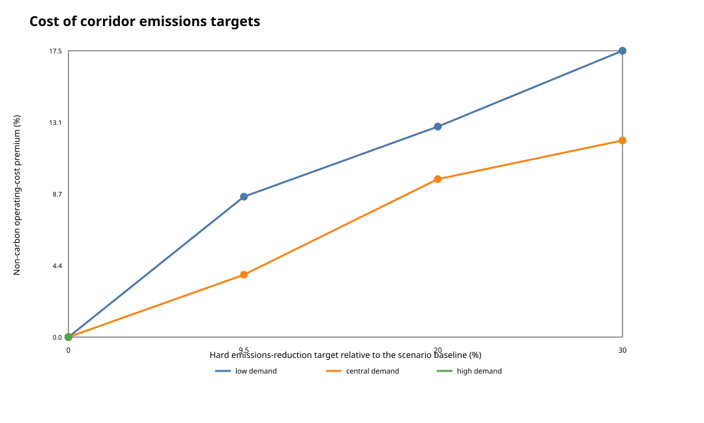
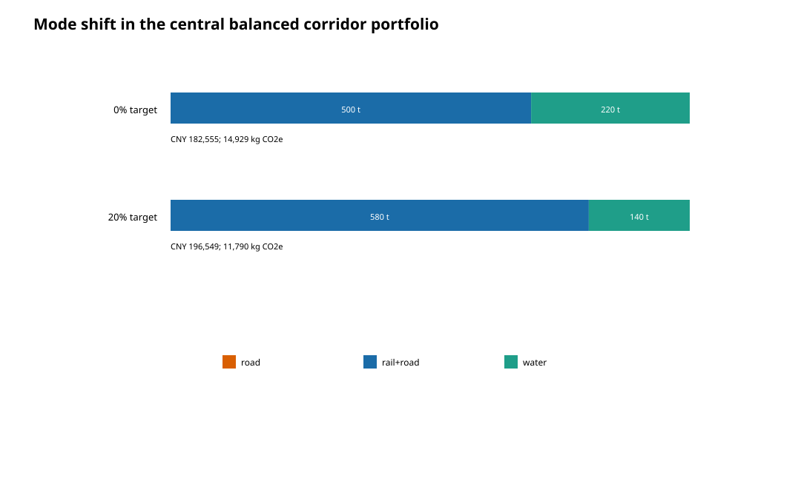

# Corridor and policy experiment results

## Single-shipment route sensitivity

At 15 t, central time and CNY 97.49/tCO2e:

- below 64.75 h: no admitted route is feasible;
- 64.75--203.99 h: rail-road is the least-cost feasible route;
- 204--239.99 h: express water is least cost;
- from 240 h: regular water is least cost.

Road becomes feasible around 96 h but is dominated by rail-road in both model cost and emissions. High CNY 6,000/tCO2e values are stress tests near route-switch boundaries, not forecasts.

## Global policy allocation

The policy experiment contains 108 screening cells and 1,800 formal GA runs across twelve selected scenarios. In the central 48-order, 720-t, balanced-deadline case at CNY 97.49/tCO2e:

| Target | Best screening cost | Emissions | Non-carbon operating-cost premium | Average abatement cost |
| ---: | ---: | ---: | ---: | ---: |
| 0% | CNY 182,555.44 | 14,929.10 kg | 0% | n/a |
| 9.5% | CNY 189,282.44 | 13,359.78 kg | 3.80% | CNY 4,384/tCO2e |
| 20% | CNY 199,670.33 | 11,594.30 kg | 9.63% | CNY 5,230/tCO2e |
| 30% | CNY 203,825.58 | 10,417.30 kg | 11.99% | CNY 4,812/tCO2e |

The 20% target achieves 22.34% because orders are indivisible. The best formal 20% run costs CNY 196,549.45 and shifts rail-road allocation from 500 t to 580 t while water falls from 220 t to 140 t.

Nine selected scenarios have at least one known feasible GA solution. In those scenarios, adaptive, catastrophe, combined and hybrid each found a feasible solution in 270/270 runs; fixed found 269/270. Greedy succeeded in 5/9 scenarios. In the three remaining stress scenarios, no tested method found a feasible solution. This is not an infeasibility proof.

The 23-city synthetic best-known result is CNY 147.96/t and 45.30 kg/t. Those normalized values sit within the broad corridor route ranges, but the comparison is only directional because the synthetic test mixes OD lengths. It is not external validation.

All raw outputs and figures are in [`benchmarks/policy-allocation`](../benchmarks/policy-allocation/).
