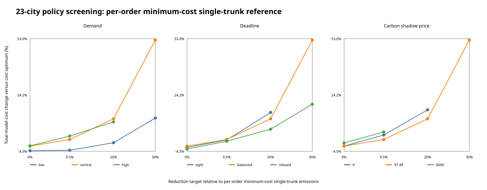
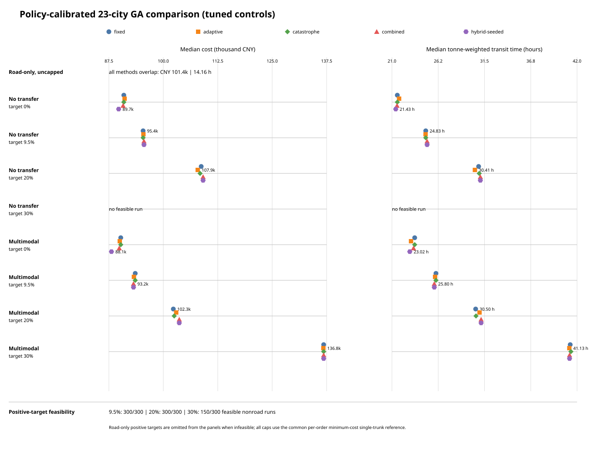
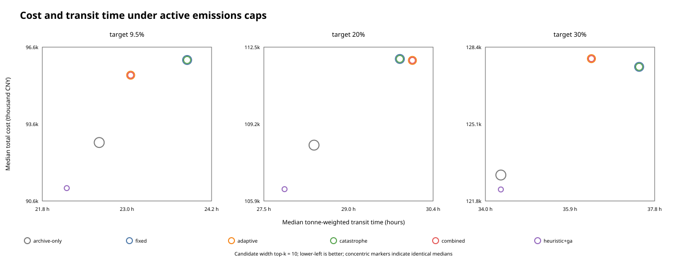

# Global order allocation

## Why allocation replaces repeated single-route search

The three-node/five-edge facility graph is valuable for checking cost, time, emissions and transfer logic, but one shipment has only four route alternatives. A GA is unnecessary there. The maintained allocation problem instead assigns many orders that compete for the same rail/water capacity and share one progressive carbon schedule.

For order `i`, gene `x_i` selects one candidate from its bounded pool:

```text
min sum_i noncarbon_cost(i, x_i) + CarbonCost(sum_i emissions(i, x_i))

subject to
  sum_i tonnes(i) * use(i, x_i, resource) <= resource tonnes capacity
  sum_i units(i)  * use(i, x_i, resource) <= resource unit capacity
  arrival(i, x_i) <= deadline(i)
  sum_i emissions(i, x_i) <= portfolio emissions cap  [optional]
```

Ranking is lexicographic: total normalized constraint violation, total cost, then emissions. Candidate retention protects the best-ranked, fastest, lowest-emission, capacity-independent and mode-diverse alternatives so a hard cap is not made artificially infeasible during preprocessing.

## Five GA variants

| Method | Adaptive rates | Partial restart | Opportunity-loss archive |
| --- | --- | --- | --- |
| fixed | No | No | No |
| adaptive | Yes | No | No |
| catastrophe | No | Yes | No |
| combined | Yes | Yes | No |
| hybrid-seeded | Yes | Yes | Yes |

All use ternary tournament selection, contiguous-segment crossover, integer mutation, parent--offspring elitism and capacity-aware random initialization. Hard-cap experiments also give every method the same low-emission constraint seed.

## Experiment roles

1. **Facility evaluator check:** 12 model orders on a three-node/five-edge graph. A four-order prefix has 3,072 combinations and is exhaustively verified. All methods reach CNY 68,449.24 on the full simple portfolio, so this case does not demonstrate GA superiority.
2. **Synthetic 23-city algorithm stress test:** 48 synthetic orders, 23 OD pairs, 145 edges and 96 shared resources. Thirty seeds per GA use 100 individuals x 150 generations. The formal best-known hybrid result is CNY 324,492.36, 18.52% below the CNY 398,224.22 deadline-greedy baseline within this instance.
3. **23-city objective and transport-policy boundary test:** the same graph and portfolio are rerun under road-only, single-mode-per-order and multimodal-enabled candidate policies. Cost is minimized with no cap or with hard reductions of 20%, 40%, 55% and 60% relative to the best-known road-only counterfactual. Five GA variants use 30 seeds in every scenario; greedy remains an auxiliary reference.
4. **Policy-calibrated 23-city matrix:** the public-policy experiment's low, central and high demand, release times, payloads, carbon-price cases and 0%, 9.5%, 20% and 30% reduction targets are applied to a 328-edge synthetic topology. OD span and cargo class set 48/60/72-hour limits. Water uses 24-hour sailings capped at 20 tonnes and two units. A 108-cell screen studies sensitivity; the formal core contains 1,800 method--seed cells across three candidate-route scopes and five GA variants.
5. **Algorithm-discrimination benchmark:** a separate cost--emissions-conflict instance with timed 20-tonne clean departures, candidate widths 6/10/14, active 9.5%/20%/30% caps, five GA variants, archive-only and a six-order exact oracle.
6. **Corridor policy experiment:** field-calibrated Chongqing--Yangshan alternatives plus deterministic model orders and assumed planning capacity. It tests demand, deadlines, carbon prices and hard reduction targets, not enterprise data scale.

The first case checks arithmetic, the second checks search behavior, the third probes the synthetic feasibility boundary, the fourth integrates the policy scenarios with the larger search problem, the fifth deliberately creates algorithmic discrimination, and the sixth checks corridor direction and policy trade-offs. None is a deployment trial.

## Policy-calibrated 23-city matrix

The screen crosses 3 demand sizes x 3 deadline profiles x 3 carbon-price cases x 4 reduction targets. Each cap uses the same traditional single-trunk comparator within a cell: every order independently chooses its minimum-cost deadline-feasible pure-water, pure-rail or pure-road candidate. Cross-order capacity is excluded from that reference and enforced in every evaluated allocation. Eighty of 108 cells yield feasible heuristic allocations. The other 28 are search outcomes, not infeasibility proofs.

The formal central case has 48 orders and 730 tonnes. All scopes use the same CNY 89,738.77 / 20,059.06 kg single-trunk reference, producing caps of 18,153.45, 16,047.25 and 14,041.34 kg. Road-only is certified infeasible for every positive target. Single-mode-per-order is feasible in all 150 runs at 9.5% and 20%, while no tested run reaches 30%. Multimodal-enabled is feasible in all 150 runs at every target. Its hybrid-seeded medians rise from CNY 88,091.21 and 23.02 hours uncapped to CNY 136,823.11 and 41.15 hours at 30%.

The policy-instance controller search uses uncapped cost on seeds 100--107, validates on seeds 110--129 and freezes the controls before formal seeds 0--29. Adaptive selects 0.75--1.25 expected mutations; combined/hybrid select 0.5--1.0 with patience 12 and a 10% partial restart. On validation, fixed, adaptive, combined and hybrid-seeded have pooled medians of CNY 90,497.69, CNY 90,597.99, CNY 90,530.90 and CNY 88,914.99. Catastrophe matches fixed because no validation restart fires; hybrid's strong archive seed produces four restarts on average.

The aligned chart shows cost and tonne-weighted time for every feasible method/target combination. Across the two nonroad scopes, 9.5% and 20% have 300/300 feasible formal runs; 30% has 150/300 because only multimodal-enabled succeeds.





Run-level outputs and evidence boundaries are in the [generated experiment record](../benchmarks/synthetic-23city-policy-matrix/README.md).

## Algorithm-discrimination benchmark

The separate hard benchmark keeps the policy-calibrated 48-order central portfolio but makes road cheap/dirty and rail/water clean/costly. Clean service is limited to departures at hours 0/24/48/72/96 with 20-tonne capacity. All three positive targets are feasible and binding relative to the uncapped candidate-set cost optimum. At top-k 10, best-found 9.5%, 20% and 30% solutions use 7, 19 and 33 clean departures, of which 5, 12 and 18 are at least 90% utilized.

The deterministic emission-repair result is reported as `archive-only`; `heuristic+ga` injects exactly that chromosome into the population. Its median cost improvement over archive-only is 1.95%, 1.75% and 0.51% across the active targets. Catastrophe alone matches fixed because restart almost never triggers, so this benchmark gives no evidence that catastrophe adds value. A six-order enumeration reports true candidate-set gaps: archive-only is 11.97%, 0.91% and 3.57% above optimum, while all GA variants reach the exact optimum in at least one run.



Full run-level outputs are in the [algorithm-discrimination record](../benchmarks/algorithm-discrimination/README.md).

## 23-city objective and transport-policy results

The reduction denominator is fixed before the cap runs: the best-known road-only cost solution for the same 2,055-t portfolio costs CNY 618,893.09, emits 217,720.96 kg and has an 18.65-h tonne-weighted transit time. `single-mode-per-order` allows road, rail or water across the portfolio but prohibits a mode change inside one order route. `multimodal-enabled` keeps both single-mode and transfer candidates; it does not force a transfer.

| Policy / target | Best-known cost | Emissions | Weighted transit | Result |
| --- | ---: | ---: | ---: | --- |
| Road-only cost | CNY 618,893.09 | 217,720.96 kg | 18.65 h | feasible |
| Single-mode-per-order cost | CNY 332,353.03 | 104,025.60 kg | 42.04 h | feasible |
| Multimodal-enabled cost archive | CNY 322,104.18 | 99,543.59 kg | 43.23 h | feasible |
| Multimodal, at least 20% below road | CNY 322,104.18 | 99,543.59 kg | 43.23 h | cap non-binding |
| Multimodal, at least 40% below road | CNY 322,104.18 | 99,543.59 kg | 43.23 h | cap non-binding |
| Multimodal, at least 55% below road | -- | -- | -- | no feasible result found |
| Multimodal, at least 60% below road | -- | -- | -- | no feasible result found |
| Single-mode-per-order, at least 55% below road | -- | -- | -- | no feasible result found |

The multimodal archive point is 47.95% cheaper and 54.28% lower-emitting than the road-only counterfactual, while its weighted transit time is longer. Relative to the best-known no-transfer portfolio, allowing transfer candidates improves cost by 3.08% and emissions by 4.31%, with a 2.83% longer weighted transit time. These percentages are synthetic model comparisons, not observed business savings.

The best-known frontier pools every discovered feasible solution with the same transport scope: a solution found in a tighter-cap search is also valid for a looser cap. Method medians and feasibility rates remain scenario-local. This keeps the heuristic frontier dominance-consistent without pretending that a pooled incumbent was produced by every scenario run. All five methods find feasible solutions in all 30 runs for the road, no-transfer, multimodal-cost, 20% and 40% scenarios. None finds a feasible solution in the three 55%/60% boundary scenarios under the tested budget; that is not an infeasibility proof.


