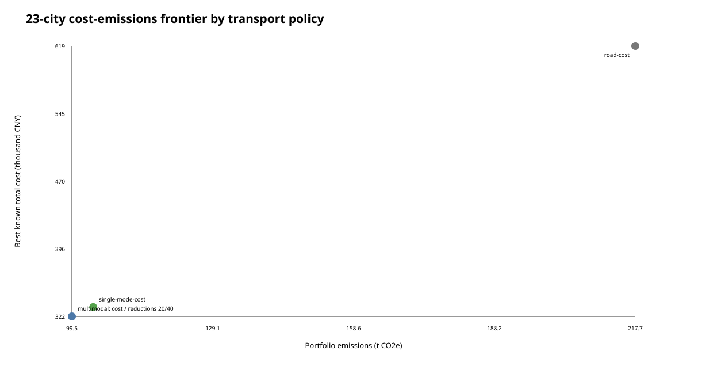
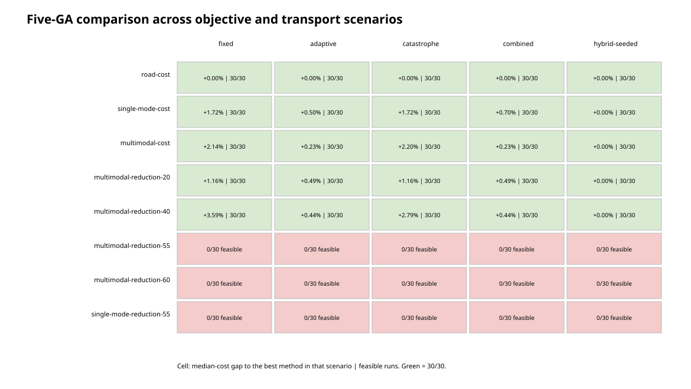

# Global order allocation

## Why allocation replaces repeated single-route search

The three-node/five-edge facility graph is valuable for checking cost, time, emissions and transfer logic, but one shipment has only four route alternatives. A GA is unnecessary there. The maintained allocation problem instead assigns many orders that compete for the same rail/water capacity and share one progressive carbon schedule.

For order `i`, gene `x_i` selects one candidate from its bounded pool:

```text
min sum_i noncarbon_cost(i, x_i) + CarbonCost(sum_i emissions(i, x_i))

subject to
  sum_i tonnes(i) * use(i, x_i, resource) <= resource tonnes capacity
  sum_i units(i)  * use(i, x_i, resource) <= resource unit capacity
  arrival(i, x_i) <= deadline(i)
  sum_i emissions(i, x_i) <= portfolio emissions cap  [optional]
```

Ranking is lexicographic: total normalized constraint violation, total cost, then emissions. Candidate retention protects the best-ranked, fastest, lowest-emission, capacity-independent and mode-diverse alternatives so a hard cap is not made artificially infeasible during preprocessing.

## Five GA variants

| Method | Adaptive rates | Partial restart | Opportunity-loss archive |
| --- | --- | --- | --- |
| fixed | No | No | No |
| adaptive | Yes | No | No |
| catastrophe | No | Yes | No |
| combined | Yes | Yes | No |
| hybrid-seeded | Yes | Yes | Yes |

All use ternary tournament selection, contiguous-segment crossover, integer mutation, parent--offspring elitism and capacity-aware random initialization. Hard-cap experiments also give every method the same low-emission constraint seed.

## Experiment roles

1. **Facility evaluator check:** 12 model orders on a three-node/five-edge graph. A four-order prefix has 3,072 combinations and is exhaustively verified. All methods reach CNY 68,449.24 on the full simple portfolio, so this case does not demonstrate GA superiority.
2. **Synthetic 23-city algorithm stress test:** 48 synthetic orders, 23 OD pairs, 145 edges and 96 shared resources. Thirty seeds per GA use 100 individuals x 150 generations. The formal best-known hybrid result is CNY 324,492.36, 18.52% below the CNY 398,224.22 deadline-greedy baseline within this instance.
3. **23-city objective and transport-policy matrix:** the same graph and portfolio are rerun under road-only, single-mode-per-order and multimodal-enabled candidate policies. Cost is minimized with no cap or with hard reductions of 20%, 40%, 55% and 60% relative to the best-known road-only counterfactual. Five GA variants use 30 seeds in every scenario; greedy remains an auxiliary reference.
4. **Corridor policy experiment:** field-calibrated Chongqing--Yangshan alternatives plus deterministic model orders and assumed planning capacity. It tests demand, deadlines, carbon prices and hard reduction targets, not enterprise data scale.

The first case checks arithmetic, the second checks search behavior, the third isolates objective and transport-scope effects, and the fourth checks corridor direction and policy trade-offs. None is a deployment trial.

## 23-city objective and transport-policy results

The reduction denominator is fixed before the cap runs: the best-known road-only cost solution for the same 2,055-t portfolio costs CNY 618,893.09, emits 217,720.96 kg and has an 18.65-h tonne-weighted transit time. `single-mode-per-order` allows road, rail or water across the portfolio but prohibits a mode change inside one order route. `multimodal-enabled` keeps both single-mode and transfer candidates; it does not force a transfer.

| Policy / target | Best-known cost | Emissions | Weighted transit | Result |
| --- | ---: | ---: | ---: | --- |
| Road-only cost | CNY 618,893.09 | 217,720.96 kg | 18.65 h | feasible |
| Single-mode-per-order cost | CNY 332,353.03 | 104,025.60 kg | 42.04 h | feasible |
| Multimodal-enabled cost archive | CNY 322,104.18 | 99,543.59 kg | 43.23 h | feasible |
| Multimodal, at least 20% below road | CNY 322,104.18 | 99,543.59 kg | 43.23 h | cap non-binding |
| Multimodal, at least 40% below road | CNY 322,104.18 | 99,543.59 kg | 43.23 h | cap non-binding |
| Multimodal, at least 55% below road | -- | -- | -- | no feasible result found |
| Multimodal, at least 60% below road | -- | -- | -- | no feasible result found |
| Single-mode-per-order, at least 55% below road | -- | -- | -- | no feasible result found |

The multimodal archive point is 47.95% cheaper and 54.28% lower-emitting than the road-only counterfactual, while its weighted transit time is longer. Relative to the best-known no-transfer portfolio, allowing transfer candidates improves cost by 3.08% and emissions by 4.31%, with a 2.83% longer weighted transit time. These percentages are synthetic model comparisons, not observed business savings.

The best-known frontier pools every discovered feasible solution with the same transport scope: a solution found in a tighter-cap search is also valid for a looser cap. Method medians and feasibility rates remain scenario-local. This keeps the heuristic frontier dominance-consistent without pretending that a pooled incumbent was produced by every scenario run. All five methods find feasible solutions in all 30 runs for the road, no-transfer, multimodal-cost, 20% and 40% scenarios. None finds a feasible solution in the three 55%/60% boundary scenarios under the tested budget; that is not an infeasibility proof.




