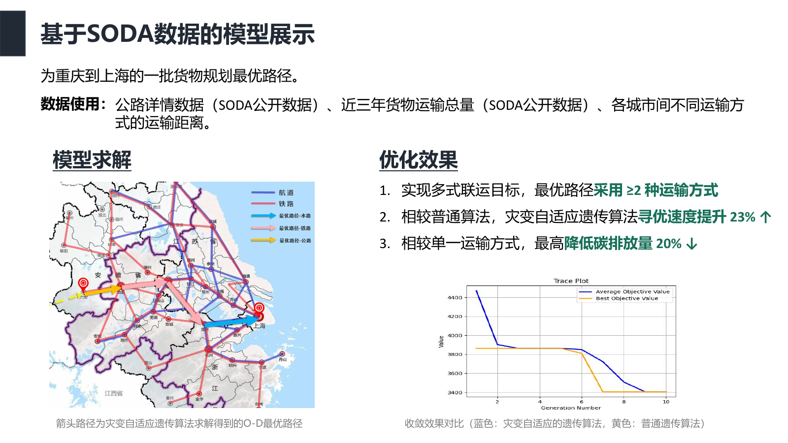
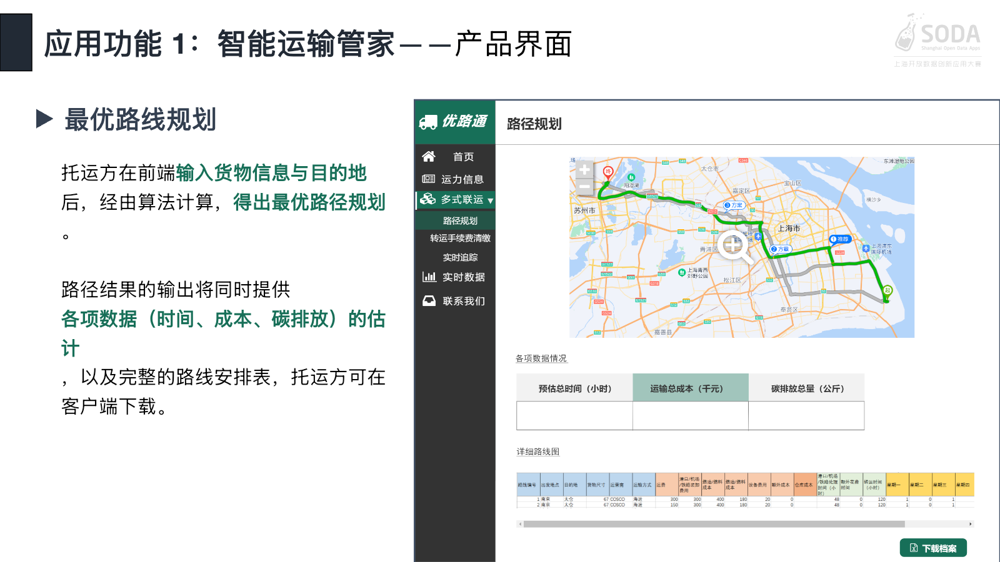
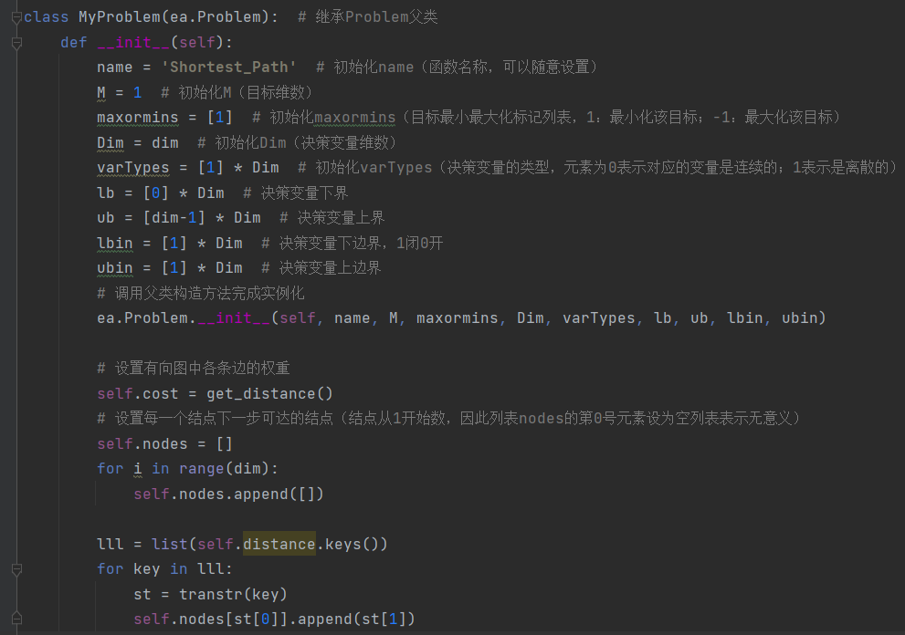
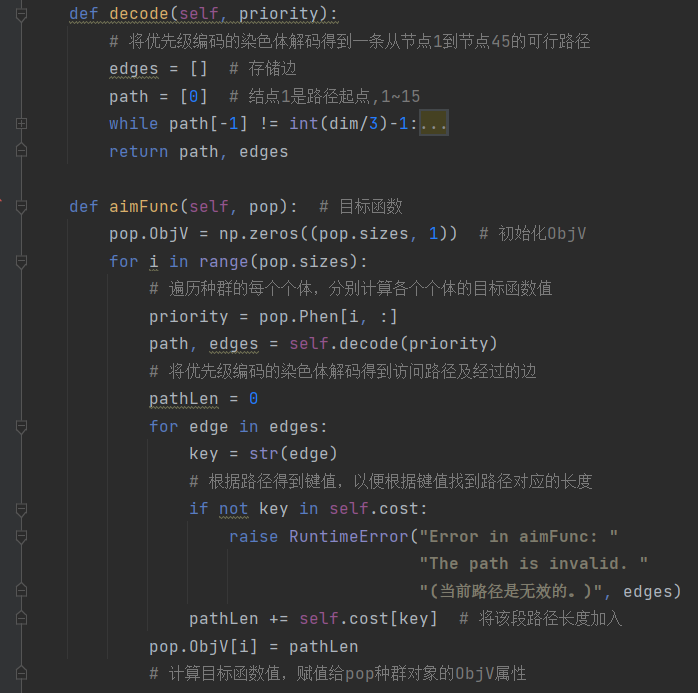

# Original process and result evidence

This gallery publishes selected full-page renders from the project's archived 2022 **semifinal** and **final** submissions, plus two exact code images embedded in the final presentation. Together they show the path from data preparation to optimization, prototype output and final case comparison.

The entry progressed through **Preliminary round → Semifinal → Final** and received Third Prize in the final stage. The complete decks are not published: selected technical pages provide useful evidence without exposing team photographs, biographies or other unnecessary personal information.

## Semifinal: data preparation

**Source:** semifinal report, page 11 of 34. The page describes the intended Pandas-based processing workflow. The complete processing scripts were not recovered, so this is design and implementation evidence rather than a fully reproducible pipeline.

## Semifinal: optimization workflow

**Source:** semifinal report, page 17 of 34. The diagram records the proposed priority encoding, adaptive crossover/mutation and catastrophe/restart workflow.

## Semifinal: route and convergence output

**Source:** semifinal report, page 18 of 34. This is an authentic archived output page. Its displayed plot contains average and best objective-value traces; it does not independently establish the accompanying exact 23% search-speed claim. See the [results audit](../docs/results.md#corrections-to-presentation-level-claims).

## Final: prototype route output

**Source:** final presentation, slide 14 of 30. This screen is a prototype demonstrating the intended route map, time/cost/emissions estimates and downloadable itinerary. It is not evidence of a production deployment.

## Final: case-study calculation

**Source:** final presentation, slide 21 of 30. For the 100-tonne Chongqing-Shanghai example, the slide reports a combined-cost route and an emission-constrained route. The repository recomputes the displayed totals as a **20.06% emissions reduction at 10.56% higher cost**, with the lower-emission option arriving 1.50 hours after the stated deadline. Definitions and caveats are in [results and validation](../docs/results.md).

## Final: historical code fragments

The following two images were embedded in slide 13 of the final presentation. They are preserved without modifying their original content. English explanations are supplied so the implementation can be understood without relying on the Chinese comments.

## Problem definition

The fragment subclasses Geatpy's `Problem`, declares an integer-valued chromosome, configures a minimization objective and begins constructing route adjacency information. Helper functions and some referenced state are outside the screenshot.

## Decoding and objective evaluation

The decoder maps a priority chromosome to a path and edge sequence. The visible fitness function iterates over the population, decodes each candidate, checks that its edges exist and accumulates edge costs. The decoder body is folded in the original screenshot.

These fragments support the use of Python, NumPy and Geatpy for a route problem. They do not by themselves demonstrate the complete final carbon-cost model, adaptive operators or uncertainty treatment. They are evidence images, not executable source files.

## Provenance and privacy boundary

- Every full-page image above is an unaltered 1600×900 raster render; none is a reconstructed or AI-generated slide.
- Source-document hashes, page/slide numbers and public-image hashes are recorded in [source-manifest.json](../source-manifest.json).
- Team-introduction pages, participant photographs, biographies, contact details and full submission files are excluded.
- Maps, interface mockups and the SODA mark remain part of the historical presentation context. No standalone ownership claim is made for third-party map tiles, framework code or competition branding.
